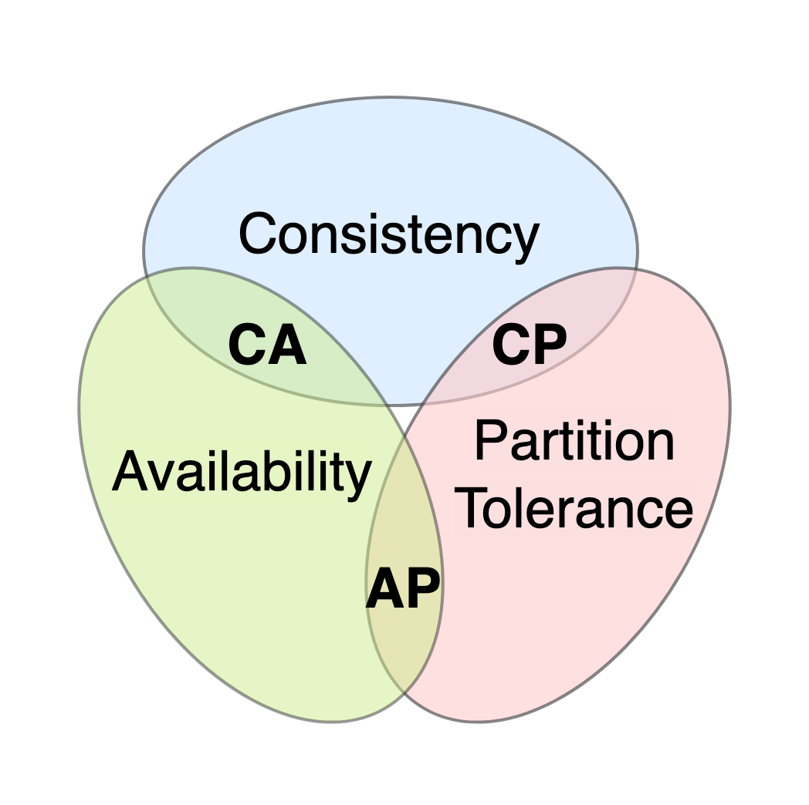

# Databases

## What is a "database"?

A database is an organized and adapted set of information for processing by a computing system.

---

## What is a "database management system" (DBMS)?

A DBMS is a set of general or specialized tools that ensure the creation, access, and management of a database.

**Main functions of a DBMS:**
- Data management
- Logging of data changes
- Data backup and recovery
- Support for data definition and manipulation language

---

## What is a "relational data model"?

A relational data model is a logical data model and applied theory for building relational databases. It includes three aspects:

- **Structural** — data is represented as a set of relations.
- **Integrity** — relations meet integrity conditions at the domain (data type), relation, and database levels.
- **Processing (manipulation)** — support for relation manipulation operators (relational algebra, relational calculus).

**Normal form** — a property of a relation characterizing it in terms of redundancy, defined as a set of requirements the relation must satisfy.

---

## Define "simple," "composite," "candidate," and "alternate" key

- **Simple key** — consists of a single attribute (field).
- **Composite key** — consists of two or more attributes.
- **Candidate key** — a simple or composite key that uniquely identifies each record. Must be irreducible: removing any field causes it to lose uniqueness.
- **Alternate key** — any candidate key that was not selected as the primary key.

---

## What is a "primary key"? What are the criteria for selecting it?

A primary key is the candidate key chosen as the main identifier for a relation. If only one candidate key exists, it is automatically the primary key.

Selection criteria:
- Smallest storage size and/or fewest attributes.
- Highest likelihood of remaining unique over time (stability).

---

## What is a "foreign key"?

A foreign key is a subset of attributes in relation A whose values must match the values of a candidate key in another relation B. It enforces referential integrity between tables.

---

## What is "normalization"?

Normalization is the process of transforming database relations into a form compliant with normal forms — a step-by-step, reversible process of replacing a schema with one where data has a simpler and more logical structure.

The goal is to reduce logical redundancy and minimize potential inconsistency of stored data. It is not aimed at improving performance or changing the physical size of the database.

---

## What are the normal forms?

- **1NF (First Normal Form)** — all attributes have atomic (indivisible) values; the table has a primary key; data is not order-dependent; no column contains mixed data types.
- **2NF (Second Normal Form)** — satisfies 1NF; all non-key attributes depend on the *entire* key, not just part of it (relevant for composite keys).
- **3NF (Third Normal Form)** — satisfies 2NF; no non-key attribute depends on another non-key attribute (no transitive dependencies).
- **4NF (Fourth Normal Form)** — satisfies 3NF; contains no independent groups of attributes with a many-to-many relationship (no multivalued dependencies).
- **5NF (Fifth Normal Form)** — satisfies 4NF; a candidate key implies every non-trivial join dependency.
- **6NF (Sixth Normal Form)** — satisfies all non-trivial join dependencies; the relation is irreducible and cannot be further decomposed without loss. An extension of 5NF for temporal databases.
- **BCNF (Boyce-Codd Normal Form)** — every non-trivial, irreducible functional dependency has a candidate key as its determinant. Stricter than 3NF.
- **DKNF (Domain-Key Normal Form)** — every constraint on the relation is a logical consequence of domain constraints and key constraints.

---

## What is "denormalization"? Why is it used?

Denormalization is the deliberate process of modifying a normalized database to make it non-compliant with normal forms. It is typically done to improve read performance and speed up data retrieval by introducing controlled redundancy.

---

## What are the types of relationships in a database?

- **One-to-One (1:1)** — each value of A corresponds to exactly one value of B, and vice versa. Example: each university has exactly one rector.
- **One-to-Many (1:M)** — each value of A corresponds to zero, one, or many values of B. Example: one university has many faculties.
- **Many-to-Many (M:N)** — each value of A corresponds to multiple values of B, and vice versa. Example: professors and faculties — one professor can teach at many faculties, and one faculty can have many professors.

---

## What are "indexes"? Advantages, disadvantages, and when to use them?

An index is a database object created to improve the performance of data retrieval. It is built from the values of one or more fields along with pointers to corresponding records, significantly increasing search speed.

**Advantages:**
- Speeds up searches and sorting on indexed fields.
- Enforces data uniqueness (unique indexes).

**Disadvantages:**
- Requires additional disk and memory space; larger keys mean larger indexes.
- Slows down `INSERT`, `UPDATE`, and `DELETE` operations since indexes must be updated too.

**Use indexes for:**
- Primary key fields.
- Fields are used frequently in joins.
- Fields used for sorting.
- Fields used for range queries.
- Fields requiring uniqueness enforcement.

**Avoid indexes for:**
- Fields are rarely used in queries.
- Fields with very low cardinality (e.g., boolean or gender fields with only 2–3 distinct values).

---

## What types of indexes exist?

**By sorting order:**
- Ordered (ascending / descending)
- Unordered

**By data source:**
- Indexes on tables
- Indexes on views
- Indexes on expressions

**By impact on data storage:**
- **Clustered index** — physically reorders the data on the disk to match the index. Only one clustered index can exist per table. Significantly improves performance for sequential data access (like a dictionary).
- **Non-clustered index** — does not alter the physical data order; stores pointers (file ID, page ID, record number, column value) to the actual data rows. Multiple non-clustered indexes can exist per table.

**By structure:**
- B-tree
- B+-tree
- Hash

**By number of keys:**
- **Simple index** — built on a single field.
- **Composite (multi-key) index** — built on multiple fields; field order matters.
- **Index with included columns** — a non-clustered index that also stores non-key columns to cover queries without touching the base table.
- **Primary index** — index on the primary key.

**By content characteristics:**
- **Unique index** — all indexed values must be unique.
- **Dense index (NoSQL)** — every document has an index entry, even if the indexed field is absent.
- **Sparse index (NoSQL)** — only documents where the indexed key has a defined value are included.
- **Spatial index** — optimized for geographic data (latitude/longitude).
- **Full-text (inverted) index** — a dictionary of all words with pointers to documents containing them; used for text search.
- **Hash index** — stores hashes of values; reduces index size and speeds up equality lookups on large fields. Cannot be used for range queries, sorting, or null checks.
- **Bitmap index** — uses bitmaps (0 s and 1 s) to indicate value presence; efficient for low-cardinality fields.
- **Reverse index** — a B-tree with reversed key bytes; prevents contention on the last leaf block for monotonically increasing values (e.g., auto-increment IDs). Cannot be used for range queries.
- **Function-based index** — stores the result of a function applied to a field (e.g., `UPPER(name)`); useful for queries on transformed values.
- **XML index** — a materialized representation of XML BLOBs stored in XML-typed columns.
- **Secondary index** — any index on fields other than the primary key.

**By update mechanism:**
- **Fully rebuildable** — the entire index is rebuilt when new elements are added.
- **Incrementally updated (balanced)** — only affected branches are updated; periodic rebalancing occurs.

**By data coverage:**
- **Full index** — covers all data in the indexed object.
- **Partial index** — built on a subset of data meeting a specific condition; reduces index size.
- **Delta (incremental) index** — indexes only recently changed data (since a timestamp); used in high-write workloads alongside a periodic full rebuild.
- **Real-time index** — a high-speed incremental index for frequently changing data.

**In clustered (sharded) systems:**
- **Global index** — covers all shards.
- **Segment index** — a global index on the shard key; used for query routing.
- **Local index** — covers only a single shard.

---

## What is the difference between clustered and non-clustered indexes?

- **Clustered index** — data is physically ordered on disk according to the index. Only one per table. Significantly faster for sequential/range reads, but slower for frequent writes.
- **Non-clustered index** — data is stored in arbitrary physical order; the index holds pointers to the actual rows. Multiple can exist per table. Better suited for frequently modified datasets.

---

## Is it reasonable to index a field with a small number of possible values?

Generally no. A rule of thumb: if the volume of data *not* matching the selection condition is smaller than the size of the index for that condition, using the index will likely slow down the query rather than speed it up. Low-cardinality fields (e.g., boolean, gender) are poor candidates for indexing.

---

## When is a full table scan more efficient than index access?

A full scan uses **multi-block reads** (reads many pages at once), while index access uses **single-block reads** (reads one page at a time, first the index, then the data). If the total cost of all single-block reads exceeds the cost of a multi-block full scan, the query optimizer will prefer the full scan.

Full scan is preferred when:
- Query predicates have **low selectivity** (many rows match).
- Data is **poorly clustered** relative to the index.
- The **dataset is tiny**.

---

## ACID

### What is a "transaction"?

A transaction is a unit of work on a database that transitions it from one consistent state to another, expressed through modifications of stored data.

### What are the main properties of a transaction?

- **Atomicity** — a transaction is all-or-nothing; either all sub-operations complete or none do.
- **Consistency** — a successfully completed transaction always leaves the database in a valid, consistent state.
- **Isolation** — concurrent transactions do not interfere with each other's results.
- **Durability** — changes from a committed transaction persist even in the event of system failure (power loss, hardware crash, etc.).

### What are the transaction isolation levels?

In increasing order of isolation and reliability:

| Level                | Dirty Read | Non-Repeatable Read | Phantom Read |
|----------------------|------------|---------------------|--------------|
| **Read Uncommitted** | Possible   | Possible            | Possible     |
| **Read Committed**   | Prevented  | Possible            | Possible     |
| **Repeatable Read**  | Prevented  | Prevented           | Possible     |
| **Serializable**     | Prevented  | Prevented           | Prevented    |

- **Read Uncommitted** — reads uncommitted changes from both its own and other transactions. Highly error-prone.
- **Read Committed** — reads only committed changes from other transactions. Most common default (e.g., PostgreSQL, Oracle).
- **Repeatable Read** — changes made by other transactions after this one started are invisible. Guarantees the same data if re-read.
- **Serializable** — the strictest level; parallel execution produces a result logically equivalent to some sequential execution. No concurrency anomalies.

### What problems can arise with parallel transaction access?

- **Lost Update** — two transactions modify the same data simultaneously; one update overwrites the other.
- **Dirty Read** — a transaction reads data modified by another transaction that later rolls back.
- **Non-Repeatable Read** — a transaction re-reads data it already read, but another committed transaction has modified it in between.
- **Phantom Read** — a transaction re-executes a query, but another committed transaction has inserted or deleted rows in between, producing a different result set.

**Phantom read example:**

| Transaction 1                             | Transaction 2                                        |
|-------------------------------------------|------------------------------------------------------|
| `SELECT SUM(f2) FROM tbl1;` → returns 100 |                                                      |
|                                           | `INSERT INTO tbl1 (f1, f2) VALUES (15, 20); COMMIT;` |
| `SELECT SUM(f2) FROM tbl1;` → returns 120 |                                                      |

Transaction 1 gets different results for the same query because Transaction 2 inserted a new "phantom" row in between.

> Unlike non-repeatable reads (caused by *modifying* existing rows), phantom reads are caused by *inserting or deleting* rows.

---

## CAP Theorem

The CAP theorem states that a distributed data system can guarantee at most **two** of the following three properties simultaneously:

- **Consistency (C)** — every read receives the most recent write or an error.
- **Availability (A)** — every request receives a response (not necessarily the most recent data).
- **Partition Tolerance (P)** — the system continues operating even if network partitions cause some nodes to be unable to communicate.

Since network partitions are unavoidable in real distributed systems, the practical tradeoff is between **consistency and availability** during a partition:

- **CP systems** — sacrifice availability; return an error if consistency cannot be guaranteed (e.g., HBase, Zookeeper).
- **AP systems** — sacrifice consistency; return the best available (possibly stale) data (e.g., Cassandra, CouchDB).
- **CA systems** — only possible without network partitions; typical of single-node relational databases.