# Design Patterns

Design patterns are typical solutions to commonly occurring problems in software design. They are blueprints that can be customized to solve a particular design problem in your code. Patterns are not code you copy - they are general concepts for solving a given problem.

---

## Classification

Patterns are categorized by their **intent** into three groups:

| Category       | Intent                                                                                                |
|----------------|-------------------------------------------------------------------------------------------------------|
| **Creational** | Object creation mechanisms that increase flexibility and reuse of existing code.                      |
| **Structural** | How to assemble objects and classes into larger structures while keeping them flexible and efficient. |
| **Behavioral** | Algorithms and the assignment of responsibilities between objects.                                    |

---

## Creational Patterns

### Factory Method

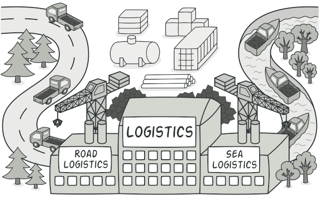

Defines an interface for creating an object, but lets subclasses decide which class to instantiate. The creator class does not need to know the concrete class it will create.

**When to use:** When you do not know ahead of time what class you need to instantiate, or when you want subclasses to control which objects get created.

```java
// Product interface
public interface Notification {
    void send(String message);
}

// Concrete products
public class EmailNotification implements Notification {
    public void send(String message) {
        System.out.println("Email: " + message);
    }
}

public class SmsNotification implements Notification {
    public void send(String message) {
        System.out.println("SMS: " + message);
    }
}

// Creator
public abstract class NotificationFactory {
    public abstract Notification createNotification();

    public void notify(String message) {
        Notification notification = createNotification();
        notification.send(message);
    }
}

// Concrete creators
public class EmailNotificationFactory extends NotificationFactory {
    public Notification createNotification() {
        return new EmailNotification();
    }
}

public class SmsNotificationFactory extends NotificationFactory {
    public Notification createNotification() {
        return new SmsNotification();
    }
}
```

---

### Abstract Factory

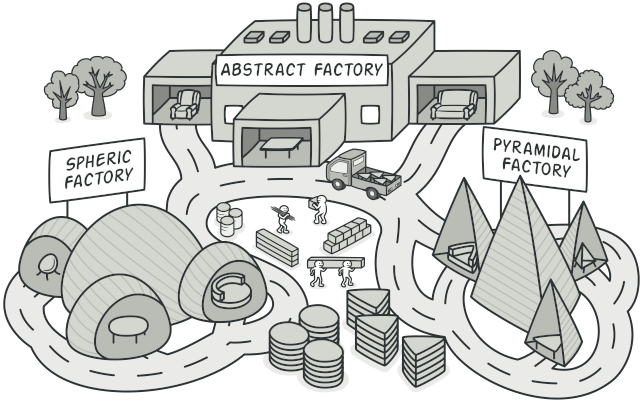

Produces families of related objects without specifying their concrete classes. All products created by a single factory are guaranteed to be compatible with each other.

**When to use:** When your code needs to work with various families of related products but you do not want it to depend on the concrete classes of those products.

```java
// Abstract products
public interface Button { void render(); }
public interface Checkbox { void render(); }

// Concrete products - Windows family
public class WindowsButton implements Button {
    public void render() { System.out.println("Windows Button"); }
}
public class WindowsCheckbox implements Checkbox {
    public void render() { System.out.println("Windows Checkbox"); }
}

// Concrete products - Mac family
public class MacButton implements Button {
    public void render() { System.out.println("Mac Button"); }
}
public class MacCheckbox implements Checkbox {
    public void render() { System.out.println("Mac Checkbox"); }
}

// Abstract factory
public interface GUIFactory {
    Button createButton();
    Checkbox createCheckbox();
}

// Concrete factories
public class WindowsFactory implements GUIFactory {
    public Button createButton()     { return new WindowsButton(); }
    public Checkbox createCheckbox() { return new WindowsCheckbox(); }
}

public class MacFactory implements GUIFactory {
    public Button createButton()     { return new MacButton(); }
    public Checkbox createCheckbox() { return new MacCheckbox(); }
}

// Client - works with any factory through the abstract interface
public class Application {
    private final Button button;
    private final Checkbox checkbox;

    public Application(GUIFactory factory) {
        this.button   = factory.createButton();
        this.checkbox = factory.createCheckbox();
    }

    public void render() {
        button.render();
        checkbox.render();
    }
}
```

---

### Builder

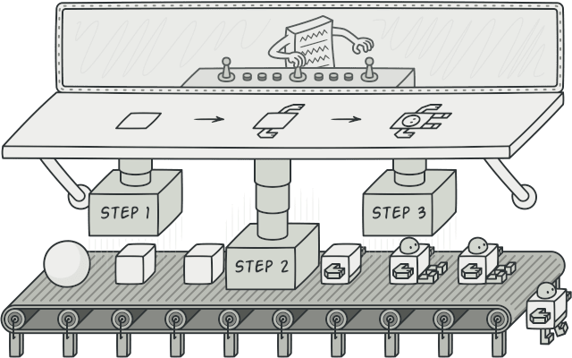

Constructs complex objects step by step. The pattern allows producing different types and representations of an object using the same construction process, separating the construction of an object from its representation.

**When to use:** When you want to construct complex objects step by step and avoid a telescoping constructor with many optional parameters.

```java
public class Pizza {
    private final String size;
    private final boolean cheese;
    private final boolean pepperoni;
    private final boolean mushrooms;

    private Pizza(Builder builder) {
        this.size       = builder.size;
        this.cheese     = builder.cheese;
        this.pepperoni  = builder.pepperoni;
        this.mushrooms  = builder.mushrooms;
    }

    public static class Builder {
        private final String size;
        private boolean cheese     = false;
        private boolean pepperoni  = false;
        private boolean mushrooms  = false;

        public Builder(String size) {
            this.size = size;
        }

        public Builder cheese(boolean value) {
            this.cheese = value;
            return this;
        }

        public Builder pepperoni(boolean value) {
            this.pepperoni = value;
            return this;
        }

        public Builder mushrooms(boolean value) {
            this.mushrooms = value;
            return this;
        }

        public Pizza build() {
            return new Pizza(this);
        }
    }
}

// Usage
Pizza pizza = new Pizza.Builder("large")
        .cheese(true)
        .pepperoni(true)
        .build();
```

---

### Prototype

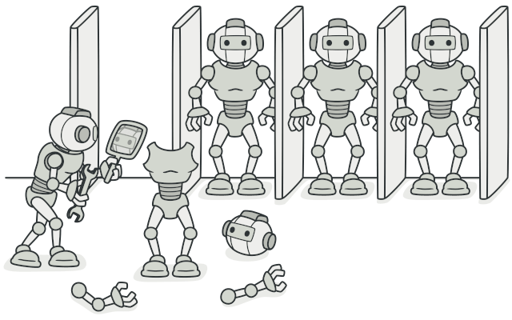

Creates new objects by copying (cloning) an existing object. The clone is independent of the original and can be modified without affecting it.

**When to use:** When object creation is expensive, and a similar object already exists, or when classes to instantiate are specified at runtime.

```java
public abstract class Shape implements Cloneable {
    public int x, y;
    public String color;

    public Shape(Shape source) {
        this.x     = source.x;
        this.y     = source.y;
        this.color = source.color;
    }

    public abstract Shape clone();
}

public class Circle extends Shape {
    public int radius;

    public Circle(Circle source) {
        super(source);
        this.radius = source.radius;
    }

    @Override
    public Circle clone() {
        return new Circle(this);
    }
}

public class Rectangle extends Shape {
    public int width, height;

    public Rectangle(Rectangle source) {
        super(source);
        this.width  = source.width;
        this.height = source.height;
    }

    @Override
    public Rectangle clone() {
        return new Rectangle(this);
    }
}
```

---

### Singleton

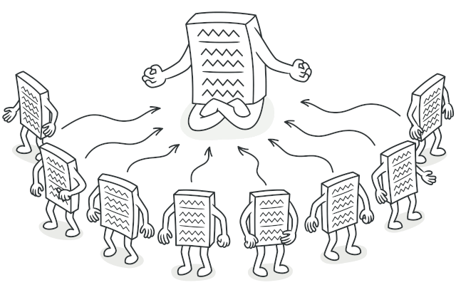

Ensures a class has only one instance and provides a global access point to it. The constructor is private; access is through a static method that returns the cached instance.

**When to use:** When exactly one object is needed to coordinate actions across the system (e.g., a database connection pool, a logger, a configuration manager).

> Note: Singleton violates the Single Responsibility Principle - the class manages both its own business logic and its instantiation. Prefer dependency injection (e.g., Spring's singleton-scoped beans) over hand-rolled singletons in modern application code.

```java
public class DatabaseConnection {

    private static volatile DatabaseConnection instance;

    private DatabaseConnection() {
        // private - prevents direct instantiation
    }

    // Thread-safe double-checked locking
    public static DatabaseConnection getInstance() {
        if (instance == null) {
            synchronized (DatabaseConnection.class) {
                if (instance == null) {
                    instance = new DatabaseConnection();
                }
            }
        }
        return instance;
    }

    public void query(String sql) {
        System.out.println("Executing: " + sql);
    }
}

// Usage
DatabaseConnection conn = DatabaseConnection.getInstance();
conn.query("SELECT * FROM users");
```

---

## Structural Patterns

### Adapter

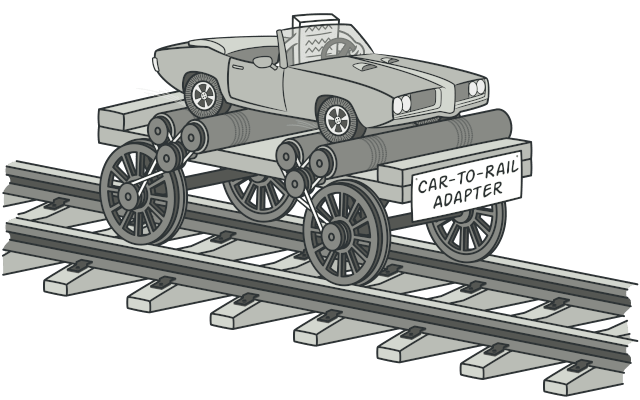

Allows objects with incompatible interfaces to collaborate by wrapping one of the objects in an adapter that translates calls into a format the other object understands.

**When to use:** When you want to use an existing class, but its interface is incompatible with the rest of your code, or when integrating with a third-party library.

```java
// Target interface your code expects
public interface JsonParser {
    String parse(String data);
}

// Incompatible third-party class
public class XmlLibrary {
    public String parseXml(String xml) {
        return "Parsed: " + xml;
    }
}

// Adapter - makes XmlLibrary look like a JsonParser
public class XmlToJsonAdapter implements JsonParser {
    private final XmlLibrary xmlLibrary;

    public XmlToJsonAdapter(XmlLibrary xmlLibrary) {
        this.xmlLibrary = xmlLibrary;
    }

    @Override
    public String parse(String data) {
        // Convert JSON-style call to the XML library's method
        String xml = convertToXml(data);
        return xmlLibrary.parseXml(xml);
    }

    private String convertToXml(String json) {
        return "<data>" + json + "</data>";
    }
}
```

---

### Bridge

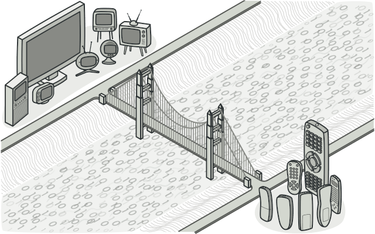

Splits a large class or a set of closely related classes into two separate hierarchies -
abstraction and implementation -
that can be developed independently.
Favors composition over inheritance.

**When to use:** When you want to split a monolithic class that has several variants of some functionality, or when you want to extend a class in several orthogonal (independent) dimensions.

```java
// Implementation hierarchy
public interface Renderer {
    void renderShape(String shape);
}

public class VectorRenderer implements Renderer {
    public void renderShape(String shape) {
        System.out.println("Drawing " + shape + " as vectors");
    }
}

public class RasterRenderer implements Renderer {
    public void renderShape(String shape) {
        System.out.println("Drawing " + shape + " as pixels");
    }
}

// Abstraction hierarchy
public abstract class Shape {
    protected Renderer renderer;

    public Shape(Renderer renderer) {
        this.renderer = renderer;
    }

    public abstract void draw();
}

public class Circle extends Shape {
    public Circle(Renderer renderer) {
        super(renderer);
    }

    @Override
    public void draw() {
        renderer.renderShape("Circle");
    }
}

public class Square extends Shape {
    public Square(Renderer renderer) {
        super(renderer);
    }

    @Override
    public void draw() {
        renderer.renderShape("Square");
    }
}

// Usage - any shape with any renderer, independently
Shape circle = new Circle(new VectorRenderer());
circle.draw(); // Drawing Circle as vectors

Shape square = new Square(new RasterRenderer());
square.draw(); // Drawing Square as pixels
```

---

### Composite

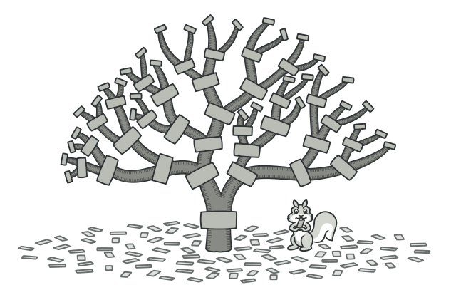

Composes objects into tree structures to represent part-whole hierarchies. Lets clients treat individual objects and compositions of objects uniformly.

**When to use:** When you need to represent a tree-like hierarchy (file systems, UI component trees, organizational charts) and want client code to treat leaves and branches the same way.

```java
public interface FileSystemItem {
    void print(String indent);
    long getSize();
}

// Leaf
public class File implements FileSystemItem {
    private final String name;
    private final long size;

    public File(String name, long size) {
        this.name = name;
        this.size = size;
    }

    public void print(String indent) {
        System.out.println(indent + name + " (" + size + " bytes)");
    }

    public long getSize() { return size; }
}

// Composite
public class Directory implements FileSystemItem {
    private final String name;
    private final List<FileSystemItem> children = new ArrayList<>();

    public Directory(String name) { this.name = name; }

    public void add(FileSystemItem item) { children.add(item); }

    public void print(String indent) {
        System.out.println(indent + name + "/");
        for (FileSystemItem child : children) {
            child.print(indent + "  ");
        }
    }

    public long getSize() {
        return children.stream().mapToLong(FileSystemItem::getSize).sum();
    }
}
```

---

### Decorator

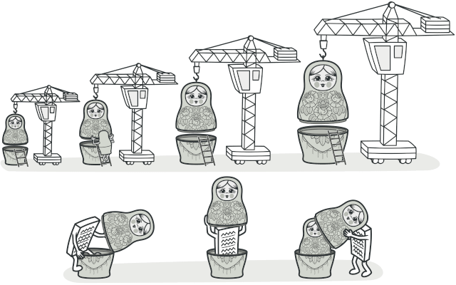

Attaches new behaviors to objects by placing them inside wrapper objects that implement the same interface. Provides a flexible alternative to subclassing for extending functionality.

**When to use:** When you want to add responsibilities to objects dynamically and transparently, without affecting other objects, and when subclassing would lead to an explosion of classes.

```java
public interface TextFormatter {
    String format(String text);
}

public class PlainText implements TextFormatter {
    public String format(String text) { return text; }
}

// Base decorator
public abstract class TextDecorator implements TextFormatter {
    protected final TextFormatter wrapped;

    public TextDecorator(TextFormatter wrapped) {
        this.wrapped = wrapped;
    }
}

// Concrete decorators
public class BoldDecorator extends TextDecorator {
    public BoldDecorator(TextFormatter wrapped) { super(wrapped); }

    public String format(String text) {
        return "<b>" + wrapped.format(text) + "</b>";
    }
}

public class ItalicDecorator extends TextDecorator {
    public ItalicDecorator(TextFormatter wrapped) { super(wrapped); }

    public String format(String text) {
        return "<i>" + wrapped.format(text) + "</i>";
    }
}

// Usage - decorators can be stacked in any order
TextFormatter formatter = new BoldDecorator(new ItalicDecorator(new PlainText()));
System.out.println(formatter.format("Hello")); // <b><i>Hello</i></b>
```

---

### Facade

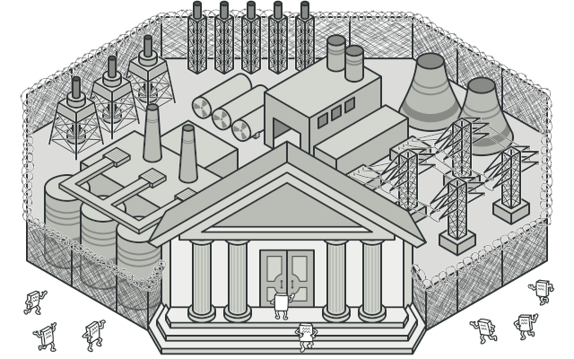

Provides a simplified interface to a complex subsystem. The facade does not forbid access to the subsystem - it just provides a convenient shortcut for the most common use cases.

**When to use:** When you want to provide a simple interface to a complex subsystem, or when you want to layer your subsystems by having facades as entry points to each layer.

```java
// Complex subsystem classes
public class VideoDecoder {
    public void decode(String file) { System.out.println("Decoding " + file); }
}

public class AudioMixer {
    public void mix(String file) { System.out.println("Mixing audio for " + file); }
}

public class SubtitleLoader {
    public void load(String file) { System.out.println("Loading subtitles for " + file); }
}

public class VideoBuffer {
    public void buffer(String file) { System.out.println("Buffering " + file); }
}

// Facade - one simple method hides the complexity
public class VideoPlayerFacade {
    private final VideoDecoder decoder     = new VideoDecoder();
    private final AudioMixer mixer         = new AudioMixer();
    private final SubtitleLoader subtitles = new SubtitleLoader();
    private final VideoBuffer buffer       = new VideoBuffer();

    public void play(String file) {
        buffer.buffer(file);
        decoder.decode(file);
        mixer.mix(file);
        subtitles.load(file);
        System.out.println("Playing: " + file);
    }
}

// Client only needs to know about the facade
VideoPlayerFacade player = new VideoPlayerFacade();
player.play("movie.mp4");
```

---

### Flyweight

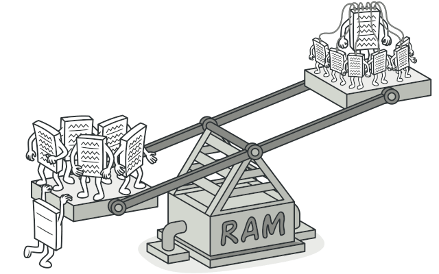

Fits more objects into the available RAM
by sharing a common state between multiple objects instead of keeping all the data in each object.
The shared state (intrinsic) is separated from the unique state (extrinsic).

**When to use:** Only when your program must support a huge number of objects that barely fit in RAM, and when most object state can be made extrinsic (passed in from outside).

```java
// Flyweight - stores intrinsic (shared) state
public class TreeType {
    private final String name;
    private final String color;
    private final String texture;

    public TreeType(String name, String color, String texture) {
        this.name    = name;
        this.color   = color;
        this.texture = texture;
    }

    public void draw(int x, int y) {
        System.out.printf("Drawing %s tree [%s/%s] at (%d,%d)%n",
                name, color, texture, x, y);
    }
}

// Flyweight factory - reuses existing flyweights
public class TreeTypeFactory {
    private static final Map<String, TreeType> cache = new HashMap<>();

    public static TreeType getTreeType(String name, String color, String texture) {
        String key = name + color + texture;
        return cache.computeIfAbsent(key, k -> new TreeType(name, color, texture));
    }
}

// Context - stores extrinsic (unique) state and a reference to the flyweight
public class Tree {
    private final int x, y;
    private final TreeType type; // shared

    public Tree(int x, int y, TreeType type) {
        this.x    = x;
        this.y    = y;
        this.type = type;
    }

    public void draw() {
        type.draw(x, y);
    }
}
```

---

### Proxy

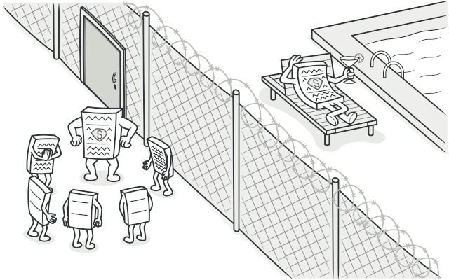

Provides a substitute or placeholder for another object. The proxy controls access to the original object, allowing you to perform tasks before or after the request reaches it (e.g., lazy initialization, access control, logging, caching).

**When to use:** For lazy initialization of a heavy object, access control, logging, caching, or remote service access.

```java
public interface DatabaseExecutor {
    void execute(String query);
}

// Real subject
public class RealDatabaseExecutor implements DatabaseExecutor {
    public void execute(String query) {
        System.out.println("Executing query: " + query);
    }
}

// Proxy - adds access control and logging
public class DatabaseExecutorProxy implements DatabaseExecutor {
    private final RealDatabaseExecutor executor = new RealDatabaseExecutor();
    private final String userRole;

    public DatabaseExecutorProxy(String userRole) {
        this.userRole = userRole;
    }

    public void execute(String query) {
        if (query.toUpperCase().startsWith("DROP") && !userRole.equals("ADMIN")) {
            throw new SecurityException("Only admins can execute DROP statements.");
        }
        System.out.println("[LOG] Executing as " + userRole);
        executor.execute(query);
    }
}
```

---

## Behavioral Patterns

### Chain of Responsibility


Passes a request along a chain of handlers. Each handler decides whether to process the request or pass it to the next handler in the chain.

**When to use:** When more than one object may handle a request, the handler is not known a priori, or when you want to issue a request to one of several objects without specifying the receiver explicitly.

```java
public abstract class SupportHandler {
    protected SupportHandler next;

    public SupportHandler setNext(SupportHandler next) {
        this.next = next;
        return next;
    }

    public abstract void handle(int level, String issue);
}

public class LevelOneSupport extends SupportHandler {
    public void handle(int level, String issue) {
        if (level == 1) {
            System.out.println("Level 1 support handling: " + issue);
        } else if (next != null) {
            next.handle(level, issue);
        }
    }
}

public class LevelTwoSupport extends SupportHandler {
    public void handle(int level, String issue) {
        if (level == 2) {
            System.out.println("Level 2 support handling: " + issue);
        } else if (next != null) {
            next.handle(level, issue);
        }
    }
}

public class LevelThreeSupport extends SupportHandler {
    public void handle(int level, String issue) {
        System.out.println("Level 3 (engineering) handling: " + issue);
    }
}

// Usage
SupportHandler l1 = new LevelOneSupport();
SupportHandler l2 = new LevelTwoSupport();
SupportHandler l3 = new LevelThreeSupport();
l1.setNext(l2).setNext(l3);

l1.handle(2, "App crashes on login"); // Level 2 support handling
l1.handle(3, "Memory leak in core");  // Level 3 handling
```

---

### Command

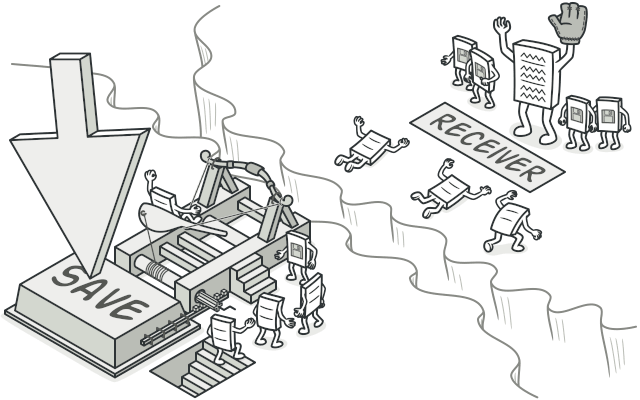

Turns a request into a stand-alone object that contains all information about it. This allows passing requests as method arguments, delaying or queuing their execution, and supporting undoable operations.

**When to use:** When you want to parameterize objects with operations, queue or schedule operations, support undo/redo, or implement transactional behavior.

```java
// Command interface
public interface Command {
    void execute();
    void undo();
}

// Receiver
public class TextEditor {
    private final StringBuilder text = new StringBuilder();

    public void write(String content) { text.append(content); }
    public void delete(int length)    { text.delete(text.length() - length, text.length()); }
    public String getText()           { return text.toString(); }
}

// Concrete command
public class WriteCommand implements Command {
    private final TextEditor editor;
    private final String content;

    public WriteCommand(TextEditor editor, String content) {
        this.editor  = editor;
        this.content = content;
    }

    public void execute() { editor.write(content); }
    public void undo()    { editor.delete(content.length()); }
}

// Invoker - keeps history for undo
public class CommandHistory {
    private final Deque<Command> history = new ArrayDeque<>();

    public void execute(Command command) {
        command.execute();
        history.push(command);
    }

    public void undo() {
        if (!history.isEmpty()) {
            history.pop().undo();
        }
    }
}
```

---

### Iterator

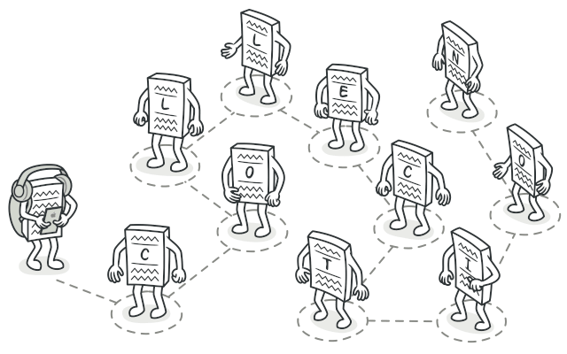

Provides a way to sequentially access elements of a collection without exposing its underlying representation. Java's `Iterable` / `Iterator` interfaces are a direct implementation of this pattern.

**When to use:** When you need a standard way to traverse different types of collections, or when you want to hide the complexity of the data structure from the client.

```java
public class NumberRange implements Iterable<Integer> {
    private final int start;
    private final int end;

    public NumberRange(int start, int end) {
        this.start = start;
        this.end   = end;
    }

    @Override
    public Iterator<Integer> iterator() {
        return new Iterator<>() {
            private int current = start;

            public boolean hasNext() { return current <= end; }
            public Integer next()    { return current++; }
        };
    }
}

// Usage - works with for-each because it implements Iterable
for (int n : new NumberRange(1, 5)) {
    System.out.print(n + " "); // 1 2 3 4 5
}
```

---

### Mediator

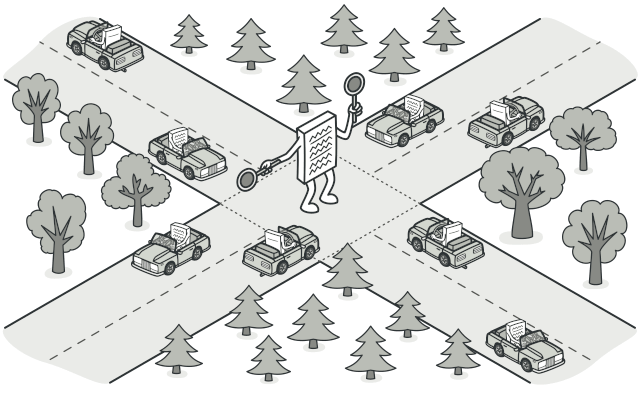

Reduces chaotic dependencies between objects by restricting direct communications and forcing them to collaborate only through a mediator object. Turns a mesh of object relationships into a star topology.

**When to use:** When many objects communicate directly with each other resulting in tight coupling, or when you want to reuse a component in a different program but it depends on other components.

```java
public interface ChatMediator {
    void sendMessage(String message, User sender);
    void addUser(User user);
}

public class ChatRoom implements ChatMediator {
    private final List<User> users = new ArrayList<>();

    public void addUser(User user) { users.add(user); }

    public void sendMessage(String message, User sender) {
        for (User user : users) {
            if (user != sender) {
                user.receive(message, sender.getName());
            }
        }
    }
}

public class User {
    private final String name;
    private final ChatMediator mediator;

    public User(String name, ChatMediator mediator) {
        this.name     = name;
        this.mediator = mediator;
    }

    public String getName() { return name; }

    public void send(String message) {
        System.out.println(name + " sends: " + message);
        mediator.sendMessage(message, this);
    }

    public void receive(String message, String from) {
        System.out.println(name + " received from " + from + ": " + message);
    }
}
```

---

### Memento

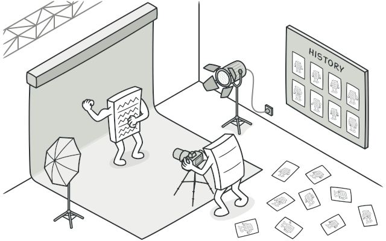

Captures and externalizes an object's internal state so it can be restored later, without violating encapsulation. The state is stored in a memento object that is opaque to everything except the originator.

**When to use:** When you need to implement undo/redo, snapshots, or state history, and you want to preserve encapsulation.

```java
// Memento - opaque snapshot of the editor's state
public class EditorMemento {
    private final String content;

    EditorMemento(String content) { this.content = content; }
    String getContent()           { return content; }
}

// Originator
public class Editor {
    private String content = "";

    public void type(String text)          { content += text; }
    public String getContent()             { return content; }
    public EditorMemento save()            { return new EditorMemento(content); }
    public void restore(EditorMemento m)   { content = m.getContent(); }
}

// Caretaker
public class History {
    private final Deque<EditorMemento> stack = new ArrayDeque<>();

    public void push(EditorMemento memento) { stack.push(memento); }
    public EditorMemento pop()              { return stack.isEmpty() ? null : stack.pop(); }
}

// Usage
Editor editor  = new Editor();
History history = new History();

editor.type("Hello ");
history.push(editor.save());

editor.type("World");
history.push(editor.save());

editor.type("!!!");
System.out.println(editor.getContent()); // Hello World!!!

editor.restore(history.pop());
System.out.println(editor.getContent()); // Hello World
```

---

### Observer

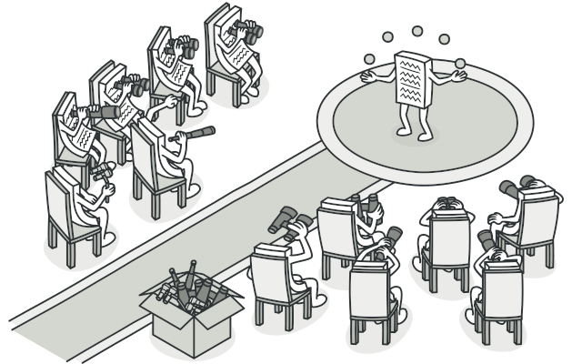

Defines a subscription mechanism to notify multiple objects about events that happen to the object they are observing.
Also known as Event-Listener or Publish-Subscribe.

**When to use:** When a change in one object requires changing others, and you do not know how many objects need to change, or when some objects should be able to observe others without being tightly coupled to them.

```java
public interface EventListener {
    void onEvent(String eventType, String data);
}

public class EventManager {
    private final Map<String, List<EventListener>> listeners = new HashMap<>();

    public void subscribe(String eventType, EventListener listener) {
        listeners.computeIfAbsent(eventType, k -> new ArrayList<>()).add(listener);
    }

    public void unsubscribe(String eventType, EventListener listener) {
        listeners.getOrDefault(eventType, Collections.emptyList()).remove(listener);
    }

    public void notify(String eventType, String data) {
        listeners.getOrDefault(eventType, Collections.emptyList())
                 .forEach(l -> l.onEvent(eventType, data));
    }
}

public class FileLogger implements EventListener {
    public void onEvent(String eventType, String data) {
        System.out.println("[LOG] " + eventType + " - " + data);
    }
}

public class EmailAlerter implements EventListener {
    public void onEvent(String eventType, String data) {
        System.out.println("[EMAIL] Alert for " + eventType + ": " + data);
    }
}

// Usage
EventManager manager = new EventManager();
manager.subscribe("upload", new FileLogger());
manager.subscribe("upload", new EmailAlerter());
manager.notify("upload", "report.pdf");
```

---

### State

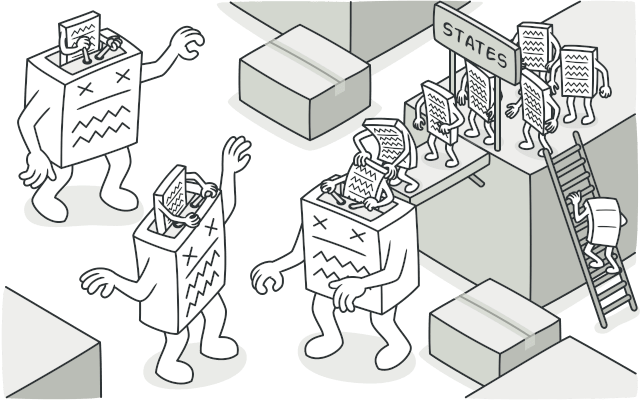

Allows an object to alter its behavior when its internal state changes.
The object appears to change its class.
Extracts state-related behaviors into separate state classes and delegates work to the current state object.

**When to use:** When an object's behavior depends on its state, and it must change at runtime, and when you have large conditional statements that depend on the object's state.

```java
public interface VendingMachineState {
    void insertCoin(VendingMachine machine);
    void dispense(VendingMachine machine);
}

public class IdleState implements VendingMachineState {
    public void insertCoin(VendingMachine machine) {
        System.out.println("Coin inserted.");
        machine.setState(new HasCoinState());
    }
    public void dispense(VendingMachine machine) {
        System.out.println("Insert a coin first.");
    }
}

public class HasCoinState implements VendingMachineState {
    public void insertCoin(VendingMachine machine) {
        System.out.println("Coin already inserted.");
    }
    public void dispense(VendingMachine machine) {
        System.out.println("Dispensing item.");
        machine.setState(new IdleState());
    }
}

public class VendingMachine {
    private VendingMachineState state = new IdleState();

    public void setState(VendingMachineState state) { this.state = state; }
    public void insertCoin()                        { state.insertCoin(this); }
    public void dispense()                          { state.dispense(this); }
}
```

---

### Strategy

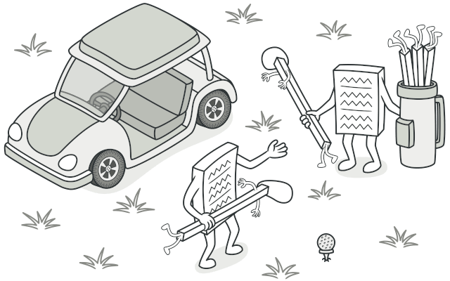

Defines a family of algorithms, puts each of them into a separate class, and makes their objects interchangeable.
Lets the algorithm vary independently of the clients that use it.

**When to use:** When you want to switch between different variants of an algorithm at runtime, or when you have a class with a massive conditional statement that switches between different variants of the same algorithm.

```java
public interface SortStrategy {
    void sort(int[] data);
}

public class BubbleSort implements SortStrategy {
    public void sort(int[] data) {
        System.out.println("Sorting with BubbleSort");
        // bubble sort logic
    }
}

public class QuickSort implements SortStrategy {
    public void sort(int[] data) {
        System.out.println("Sorting with QuickSort");
        // quicksort logic
    }
}

public class Sorter {
    private SortStrategy strategy;

    public Sorter(SortStrategy strategy) {
        this.strategy = strategy;
    }

    public void setStrategy(SortStrategy strategy) {
        this.strategy = strategy;
    }

    public void sort(int[] data) {
        strategy.sort(data);
    }
}

// Usage - swap strategies at runtime
Sorter sorter = new Sorter(new BubbleSort());
sorter.sort(new int[]{5, 3, 1});

sorter.setStrategy(new QuickSort());
sorter.sort(new int[]{5, 3, 1});
```

---

### Template Method

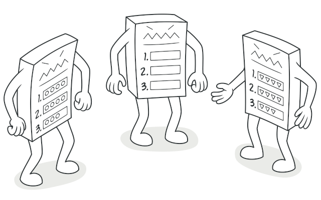

Defines the skeleton of an algorithm in a base class, deferring some steps to subclasses. Subclasses can override specific steps without changing the algorithm's overall structure.

**When to use:** When you want to let subclasses implement variations of an algorithm while keeping the overall structure intact, and to avoid code duplication across similar classes.

```java
public abstract class DataExporter {

    // Template method - defines the algorithm skeleton
    public final void export(String data) {
        String parsed   = parse(data);
        String formatted = format(parsed);
        write(formatted);
    }

    protected abstract String parse(String data);
    protected abstract String format(String parsed);

    protected void write(String output) {
        System.out.println("Writing: " + output);
    }
}

public class CsvExporter extends DataExporter {
    protected String parse(String data)    { return "parsed:" + data; }
    protected String format(String parsed) { return "CSV[" + parsed + "]"; }
}

public class JsonExporter extends DataExporter {
    protected String parse(String data)    { return "parsed:" + data; }
    protected String format(String parsed) { return "{\"data\":\"" + parsed + "\"}"; }
}

// Usage
new CsvExporter().export("raw");   // Writing: CSV[parsed:raw]
new JsonExporter().export("raw");  // Writing: {"data":"parsed:raw"}
```

---

### Visitor

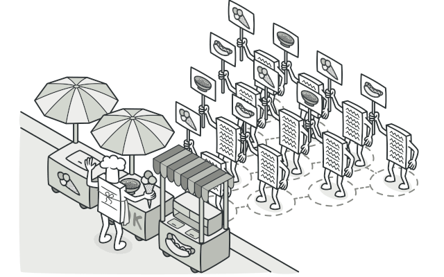

Lets you add further operations to objects without modifying them. You separate the algorithm from the object structure on which it operates by placing the new behavior into a separate visitor class.

**When to use:** When you need to perform many distinct and unrelated operations on an object structure without polluting their classes, or when the object structure classes rarely change but you often want to add new operations.

```java
public interface Visitor {
    void visit(Circle circle);
    void visit(Rectangle rectangle);
}

public interface Shape {
    void accept(Visitor visitor);
}

public class Circle implements Shape {
    public double radius;
    public Circle(double radius) { this.radius = radius; }
    public void accept(Visitor visitor) { visitor.visit(this); }
}

public class Rectangle implements Shape {
    public double width, height;
    public Rectangle(double width, double height) {
        this.width = width; this.height = height;
    }
    public void accept(Visitor visitor) { visitor.visit(this); }
}

// Concrete visitor - new operation without touching shapes
public class AreaCalculator implements Visitor {
    public void visit(Circle c) {
        System.out.printf("Circle area: %.2f%n", Math.PI * c.radius * c.radius);
    }
    public void visit(Rectangle r) {
        System.out.printf("Rectangle area: %.2f%n", r.width * r.height);
    }
}

// Usage
List<Shape> shapes = List.of(new Circle(5), new Rectangle(4, 6));
Visitor calculator = new AreaCalculator();
shapes.forEach(s -> s.accept(calculator));
```

---

## Pattern Summary

### Creational

| Pattern          | Intent                                                                   |
|------------------|--------------------------------------------------------------------------|
| Factory Method   | Delegates instantiation to subclasses.                                   |
| Abstract Factory | Creates families of related objects without specifying concrete classes. |
| Builder          | Constructs complex objects step by step.                                 |
| Prototype        | Clones existing objects instead of building from scratch.                |
| Singleton        | Ensures a class has only one instance.                                   |

### Structural

| Pattern   | Intent                                                                            |
|-----------|-----------------------------------------------------------------------------------|
| Adapter   | Makes incompatible interfaces work together.                                      |
| Bridge    | Separates abstraction from implementation so they can vary independently.         |
| Composite | Treats individual objects and groups of objects uniformly.                        |
| Decorator | Adds behavior to objects dynamically by wrapping them.                            |
| Facade    | Provides a simplified interface to a complex subsystem.                           |
| Flyweight | Shares common state to efficiently support large numbers of fine-grained objects. |
| Proxy     | Controls access to another object.                                                |

### Behavioral

| Pattern                 | Intent                                                                     |
|-------------------------|----------------------------------------------------------------------------|
| Chain of Responsibility | Passes a request along a chain of handlers.                                |
| Command                 | Turns a request into a stand-alone object, enabling undo/redo and queuing. |
| Iterator                | Provides sequential access to a collection without exposing its internals. |
| Mediator                | Reduces coupling by centralizing communication between objects.            |
| Memento                 | Captures and restores an object's state without breaking encapsulation.    |
| Observer                | Notifies multiple objects about state changes in another object.           |
| State                   | Alters an object's behavior when its internal state changes.               |
| Strategy                | Makes a family of algorithms interchangeable at runtime.                   |
| Template Method         | Defines an algorithm's skeleton, deferring specific steps to subclasses.   |
| Visitor                 | Adds operations to objects without modifying their classes.                |