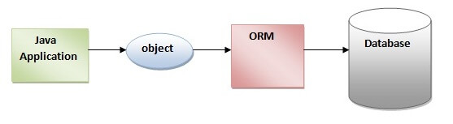
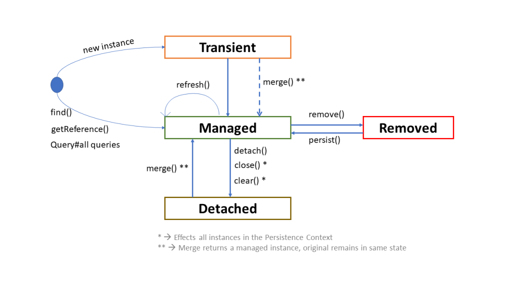

# Hibernate

## ORM

**Object/Relational Mapping (ORM)** is the automated and transparent persistence of Java objects to tables in an SQL database, using metadata that describes the mapping between application classes and the database schema.

In other words, ORM is a programming technique that maps objects to data stored in a database.



---

## JPA

**JPA (Java Persistence API)** is a Java specification for accessing, managing, and persisting data between Java objects and relational databases. It is the standard approach for Object-Relational Mapping in Java.

JPA acts as a bridge between object-oriented domain models and relational database systems. Being a specification, JPA doesn't perform any operation by itself - it requires an implementation. ORM tools like Hibernate, TopLink, and iBatis implement the JPA specification for data persistence.

---

## Hibernate

**Hibernate** is an open-source, lightweight Java framework for storing Java objects in relational databases. It is an implementation of JPA and follows all common standards provided by the specification.

---

## JPA vs Hibernate

|                   | JPA                                                | Hibernate                                               |
|-------------------|----------------------------------------------------|---------------------------------------------------------|
| Type              | Specification                                      | Implementation                                          |
| Purpose           | Defines management of relational data in Java apps | ORM tool for persisting Java object state to a database |
| Factory interface | `EntityManagerFactory`                             | `SessionFactory`                                        |
| Working interface | `EntityManager`                                    | `Session`                                               |
| Query language    | JPQL (Java Persistence Query Language)             | HQL (Hibernate Query Language)                          |

---

## Entity

Entities in JPA are POJOs representing data that can be persisted to the database. An entity represents a table; each instance represents a row.

Each entity is associated with metadata describing its mapping. This metadata can be defined as:
- **Annotations** - metadata tags inside the class (most common).
- **XML** - metadata defined outside the class in an XML file.

---

## Entity Annotations

All JPA annotations are defined in the `javax.persistence` package. Hibernate annotations are based on the JPA 2 specification and support all its features.

### `@Entity`

Marks a class as a JPA entity. The class must have a no-arg constructor and a primary key. Entity classes must not be declared `final`, as JPA implementations may subclass them.

```java
@Entity
public class Customer {
    // fields, getters and setters
}
```

### `@Id` and `@GeneratedValue`

Defines the primary key. `@GeneratedValue` specifies the generation strategy:

| Strategy   | Behavior                              |
|------------|---------------------------------------|
| `AUTO`     | JPA provider chooses the strategy     |
| `IDENTITY` | Database auto-increment column        |
| `SEQUENCE` | Database sequence                     |
| `TABLE`    | Separate table to simulate a sequence |

```java
@Entity
public class Customer {

    @Id
    @GeneratedValue(strategy = GenerationType.AUTO)
    private Long id;
}
```

### `@Table`

Specifies the table name (and optionally schema) when it differs from the entity name. If omitted, the entity class name is used as the table name.

```java
@Entity
@Table(name = "CUSTOMER", schema = "SHOP")
public class Customer { ... }
```

### `@Column`

Defines column-level details. If omitted, the field name is used as the column name.

```java
@Column(name = "CUSTOMER_NAME", length = 50, nullable = false, unique = false)
private String name;
```

Key attributes: `name`, `length`, `nullable`, `unique`.

### `@Transient`

Marks a field as non-persistent - it will not be mapped to any database column.

```java
@Transient
private Integer age; // calculated at runtime, not stored
```

### `@Enumerated`

Persists a Java enum. Use `EnumType.STRING` to store the name (recommended) or `EnumType.ORDINAL` (default) to store the position.

```java
@Enumerated(EnumType.STRING)
private Gender gender;
```

### `@Temporal`

Specifies how a `java.util.Date` or `java.util.Calendar` is mapped to the database.

```java
@Temporal(TemporalType.DATE)
private Date birthDate;
```

### Full Example

```java
@Entity
@Table(name = "CUSTOMER")
public class Customer {

    @Id
    @GeneratedValue(strategy = GenerationType.AUTO)
    private Long id;

    @Column(name = "CUSTOMER_NAME", length = 50, nullable = false)
    private String name;

    @Transient
    private Integer age;

    @Temporal(TemporalType.DATE)
    private Date birthDate;

    @Enumerated(EnumType.STRING)
    private Gender gender;
}
```

---

## Entity Relationships

JPA defines four annotations for entity relationships:

| Annotation    | Relationship                         |
|---------------|--------------------------------------|
| `@OneToOne`   | One entity maps to exactly one other |
| `@OneToMany`  | One entity maps to a collection      |
| `@ManyToOne`  | Many entities map to one             |
| `@ManyToMany` | Many entities map to many            |

### `@OneToOne`

```java
@Entity
public class Customer {

    @OneToOne(mappedBy = "customer")
    private Address address;
}

@Entity
public class Address {

    @Id
    private Long id;

    @OneToOne
    private Customer customer;
}
```

`mappedBy` tells JPA that `Address.customer` is the owning side of the relationship.

### `@OneToMany` / `@ManyToOne`

Both sides of the same relationship. A `Customer` can have many `Order`s; each `Order` belongs to one `Customer`.

```java
@Entity
public class Customer {

    @OneToMany(mappedBy = "customer")
    private List<Order> orders = new ArrayList<>();
}

@Entity
public class Order {

    @ManyToOne
    @JoinColumn(name = "CUSTOMER_ID")
    private Customer customer;
}
```

`@JoinColumn` specifies the foreign key column name in the `Order` table.

### `@ManyToMany`

Requires a join table. The owning side uses `@JoinTable` to define it.

```java
@Entity
public class Order {

    @ManyToMany
    @JoinTable(
        name = "ORDER_ITEM",
        joinColumns = @JoinColumn(name = "ORDER_ID"),
        inverseJoinColumns = @JoinColumn(name = "ITEM_ID")
    )
    private Set<Item> items = new HashSet<>();
}

@Entity
public class Item {

    @ManyToMany(mappedBy = "items")
    private Set<Order> orders = new HashSet<>();
}
```

---

## Lazy vs Eager Loading

JPA defines two fetch strategies:

| Strategy | Behavior                                                       |
|----------|----------------------------------------------------------------|
| `EAGER`  | Data is loaded immediately along with the parent entity        |
| `LAZY`   | Data is loaded only when first accessed (hint to the provider) |

Lazy loading defers fetching associated data until it's actually needed. Eager loading fetches everything upfront.

```java
@ManyToOne(fetch = FetchType.LAZY)
@JoinColumn(name = "CUSTOMER_ID")
private Customer customer;
```

Default fetch types by relationship:

| Annotation    | Default fetch |
|---------------|---------------|
| `@ManyToOne`  | `EAGER`       |
| `@OneToOne`   | `EAGER`       |
| `@OneToMany`  | `LAZY`        |
| `@ManyToMany` | `LAZY`        |

---

## Entity Lifecycle

An entity object passes through four states:

```
new/transient → [persist] → managed → [remove] → removed
                                ↕
                           [detach / close session]
                                ↓
                           detached → [merge] → managed
```



| State         | Description                                                                                 |
|---------------|---------------------------------------------------------------------------------------------|
| **Transient** | Created with `new`, not associated with any persistence context, no DB identity             |
| **Managed**   | Has a persistent identity, associated with an active persistence context                    |
| **Detached**  | Has a persistent identity, but the persistence context was closed or the entity was evicted |
| **Removed**   | Scheduled for deletion from the database                                                    |

The `EntityManager` (JPA) or `Session` (Hibernate) API drives state transitions.

---

## SessionFactory and Session

`HibernateUtil` is a common pattern for creating a singleton `SessionFactory`. Creating a `SessionFactory` is expensive and should be done only once at application startup.

```java
public class HibernateUtil {

    private static final SessionFactory sessionFactory = buildSessionFactory();

    private static SessionFactory buildSessionFactory() {
        try {
            Configuration configuration = new Configuration();
            configuration.setProperty("hibernate.connection.driver_class", "com.mysql.cj.jdbc.Driver");
            configuration.setProperty("hibernate.connection.url", "jdbc:mysql://localhost:3306/study");
            configuration.setProperty("hibernate.connection.username", "{username}");
            configuration.setProperty("hibernate.connection.password", "{password}");
            configuration.setProperty("hibernate.show_sql", "true");
            configuration.setProperty("hibernate.hbm2ddl.auto", "update");
            configuration.addAnnotatedClass(User.class);
            return configuration.buildSessionFactory();
        } catch (Exception ex) {
            throw new ExceptionInInitializerError(ex);
        }
    }

    public static SessionFactory getSessionFactory() { return sessionFactory; }

    public static void shutdown() { getSessionFactory().close(); }
}
```

- Sessions are created with `sessionFactory.openSession()`.
- Transactions are created with `session.beginTransaction()`.

---

## CRUD Operations

### Save

```java
// JPA
Customer customer = new Customer();
customer.setName("Ivan");
entityManager.persist(customer);

// Hibernate
Customer customer = new Customer();
customer.setName("Ivan");
session.save(customer);
```

### Update

```java
// JPA - changes to managed entities are auto-detected on flush
Customer customer = entityManager.find(Customer.class, 1L);
customer.setName("Peter");
entityManager.flush();

// Hibernate
Customer customer = session.byId(Customer.class).load(1L);
customer.setName("Peter");
session.flush();
```

### Delete

```java
// JPA
entityManager.remove(customer);

// Hibernate
session.delete(customer);
```

### Delete with transaction (full example)

```java
Session session = HibernateUtil.getSessionFactory().openSession();
Transaction transaction = session.beginTransaction();

try {
    User user = session.get(User.class, 2);
    if (user != null) {
        session.delete(user);
    }
    transaction.commit();
} catch (Exception e) {
    System.out.println(e.getMessage());
} finally {
    if (session != null) session.close();
    HibernateUtil.shutdown();
}
```

---

## JPQL & HQL

**JPQL (Java Persistence Query Language)** is an object-oriented query language defined by JPA - similar to SQL but operates on entities and their fields rather than tables and columns.

**HQL (Hibernate Query Language)** is Hibernate's superset of JPQL. Every valid JPQL query is valid HQL, but not vice versa.

Advantages of HQL: database-independent, supports polymorphic queries, familiar syntax for Java developers.

In Hibernate, queries are represented as `org.hibernate.query.Query`, obtained from a `Session`.

### Basic SELECT

```java
// Shorthand
List<User> users = session.createQuery("from User", User.class).list();

// Full form
List<Customer> customers = session.createQuery("select c from Customer c", Customer.class).list();
```

### Query Parameters

**Named parameters** (`:name`):

```java
Query<User> query = session.createQuery(
    "select u from User u where u.email like :email", User.class);
query.setParameter("email", "%" + "admin" + "%");
List<User> users = query.list();
```

**Positional parameters** (`?`), HQL-style (JDBC syntax):

```java
Query query = session.createQuery("select c from Customer c where c.name = ?");
query.setParameter(0, "Ivan");
```

### Execution Methods

| Method                 | Returns       | Notes                                    |
|------------------------|---------------|------------------------------------------|
| `query.list()`         | `List<T>`     | Returns all matching results             |
| `query.uniqueResult()` | Single entity | Throws exception if more than one result |

```java
// List
List<Customer> customers = session.createQuery(
    "select c from Customer c where c.name like :name")
    .setParameter("name", "Iv%")
    .list();

// Single result
Customer customer = (Customer) session.createQuery(
    "select c from Customer c where c.name like :name")
    .setParameter("name", "Iv%")
    .uniqueResult();
```

### UPDATE and DELETE

Both HQL and JPQL support UPDATE and DELETE. Use `executeUpdate()`:

```java
// UPDATE
session.createQuery("update Customer set name = :newName where name = :oldName")
    .setParameter("oldName", oldName)
    .setParameter("newName", newName)
    .executeUpdate();

// DELETE
session.createQuery("delete from Customer where name = :name")
    .setParameter("name", "Ivan")
    .executeUpdate();
```

### INSERT (HQL only - no JPQL equivalent)

```
insert_statement ::= INSERT INTO entity_name (attribute_list) select_statement
```

### Aggregate Functions

Supported: `max()`, `min()`, `sum()`, `avg()`, `count()`.

```java
String hql = "select max(e.salary) from Employee as e";
int maxSalary = (int) session.createQuery(hql).uniqueResult();
```

---

## Criteria API

The Criteria API provides a programmatic, type-safe alternative to HQL for building dynamic queries.

```java
Criteria criteria = session.createCriteria(Employee.class);
criteria.add(Restrictions.gt("salary", 10000));
criteria.addOrder(Order.asc("firstName"));
List<Employee> employees = criteria.list();

for (Employee ee : employees) {
    System.out.println("First name: " + ee.getFirstName());
}
```

Use `Restrictions` methods to add conditions (`gt`, `lt`, `eq`, `like`, etc.) and `Order` to sort results.

---

## `@Transactional`

`@Transactional` in Spring uses AOP to wrap annotated methods in a database transaction automatically.

**How it works:**

1. Spring detects `@Transactional` and wraps the bean in a proxy (JDK dynamic proxy or CGLIB).
2. The proxy uses a `TransactionInterceptor` to manage the transaction lifecycle.
3. The interceptor delegates to a `PlatformTransactionManager` (e.g., `JpaTransactionManager`).

**Transaction flow:**

| Phase             | Action                                                       |
|-------------------|--------------------------------------------------------------|
| Before method     | Proxy opens a connection and starts (or joins) a transaction |
| During method     | Business logic executes                                      |
| After (success)   | Transaction is committed                                     |
| After (exception) | Transaction is rolled back                                   |

**Critical considerations:**

- **Self-invocation** - calling a `@Transactional` method from within the same class bypasses the proxy; the transaction won't apply.
- **Public methods only** - proxies typically don't intercept `protected` or `private` methods.
- **Default rollback behavior** - rolls back on `RuntimeException` and `Error`; does **not** roll back on checked exceptions by default.

---

## Caching

Hibernate has three levels of caching to reduce database queries.

### First-Level Cache (L1 - Session Cache)

- **Scope:** Tied to a single `Session` object; not shared between sessions.
- **Default:** Always enabled, cannot be disabled.
- **Lifetime:** Lives as long as the session is open.
- **Behavior:** First load hits the DB; subsequent loads of the same entity within the session are served from cache.
- **Management:** Manual via `session.evict(entity)` or `session.clear()`.

### Second-Level Cache (L2 - SessionFactory Cache)

- **Scope:** Tied to `SessionFactory`; shared across all sessions from that factory.
- **Default:** Disabled; must be explicitly configured.
- **Implementation:** Hibernate integrates with third-party providers: Ehcache, Infinispan, Hazelcast, Redis.
- **Concurrency strategies:**

| Strategy               | Description                            |
|------------------------|----------------------------------------|
| `READ_ONLY`            | For data that never changes            |
| `NONSTRICT_READ_WRITE` | Rarely updated data; no strict locking |
| `READ_WRITE`           | Updated data; uses soft locks          |
| `TRANSACTIONAL`        | Fully transactional; requires JTA      |

### Query Cache

- Works alongside L2 cache.
- Caches the **identifiers** of entities returned by a query (not the entities themselves - those are in L2).
- Useful for frequently repeated queries with identical parameters.
- Must be explicitly enabled: `hibernate.cache.use_query_cache=true` and `query.setCacheable(true)`.

### Cache Comparison

|                    | L1 (Session)            | L2 (SessionFactory)            |
|--------------------|-------------------------|--------------------------------|
| Associated with    | `Session`               | `SessionFactory`               |
| Enabled by default | Yes                     | No                             |
| Data sharing       | Isolated to one session | Shared across all sessions     |
| Lifetime           | Duration of the session | Duration of the SessionFactory |
| Management         | `evict()` / `clear()`   | `evict()` / `clear()`          |

---

## `updatable = false`

Used in `@Column` or `@JoinColumn` to exclude a field from SQL `UPDATE` statements.

- The field is written on `INSERT` but ignored on subsequent `UPDATE`s.
- Hibernate silently ignores changes to the field - no exception is thrown.
- The database retains the original value.

```java
@Column(name = "CREATED_AT", updatable = false)
private LocalDateTime createdAt;
```

---

## `@Transient`

Marks a field as non-persistent. Hibernate will not create a column for it, and it will not be saved to or loaded from the database.

```java
@Transient
private Integer age; // calculated, not persisted
```

---

## Cascading

Cascading automates the propagation of state changes from a parent entity to its children (e.g., saving or deleting child records when the parent is saved or deleted). Configured in the relationship annotation:

```java
@OneToMany(mappedBy = "order", cascade = CascadeType.ALL)
private List<OrderLine> lines;
```

### Cascade Types

| Type                  | Effect                                            |
|-----------------------|---------------------------------------------------|
| `CascadeType.ALL`     | Propagates all operations                         |
| `CascadeType.PERSIST` | Saves children when parent is saved               |
| `CascadeType.MERGE`   | Updates children when parent is updated           |
| `CascadeType.REMOVE`  | Deletes children when parent is deleted           |
| `CascadeType.REFRESH` | Reloads children when parent is refreshed from DB |
| `CascadeType.DETACH`  | Detaches children when parent is detached         |

### Best Practices

- **Avoid `CascadeType.ALL` unless necessary** - prefer granular types (`PERSIST`, `MERGE`) to prevent accidental deletions.
- **`orphanRemoval = true`** - removes child entities that are no longer referenced by the parent (e.g., removed from a collection). Complements `REMOVE` but fires on de-association, not just deletion.
- **Watch performance** - cascades on large collections can generate many SQL statements.
- **Ideal use case** - parent-child relationships where the child's lifecycle depends entirely on the parent (e.g., `Order` → `OrderLine`).