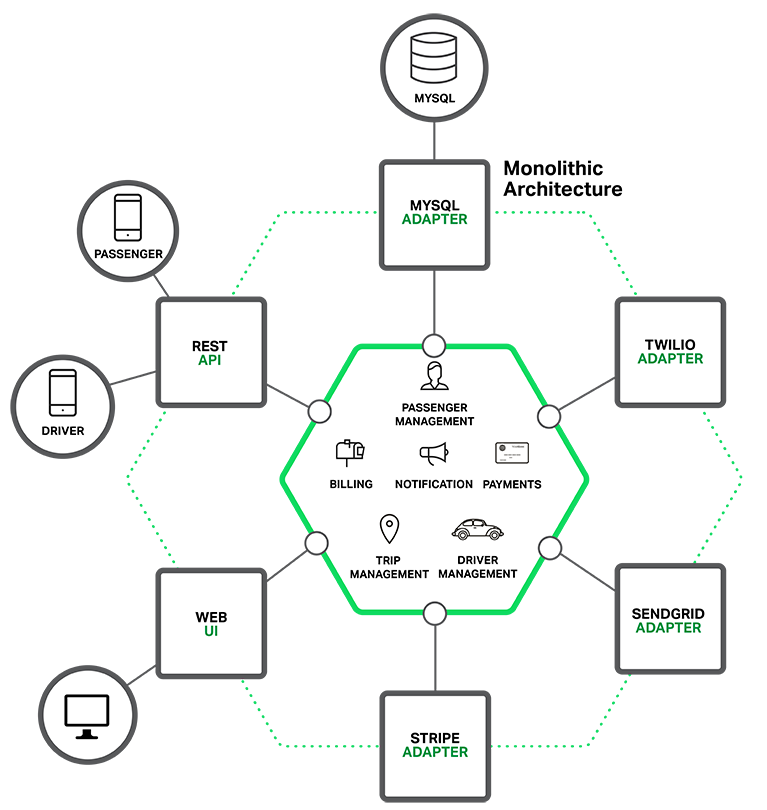
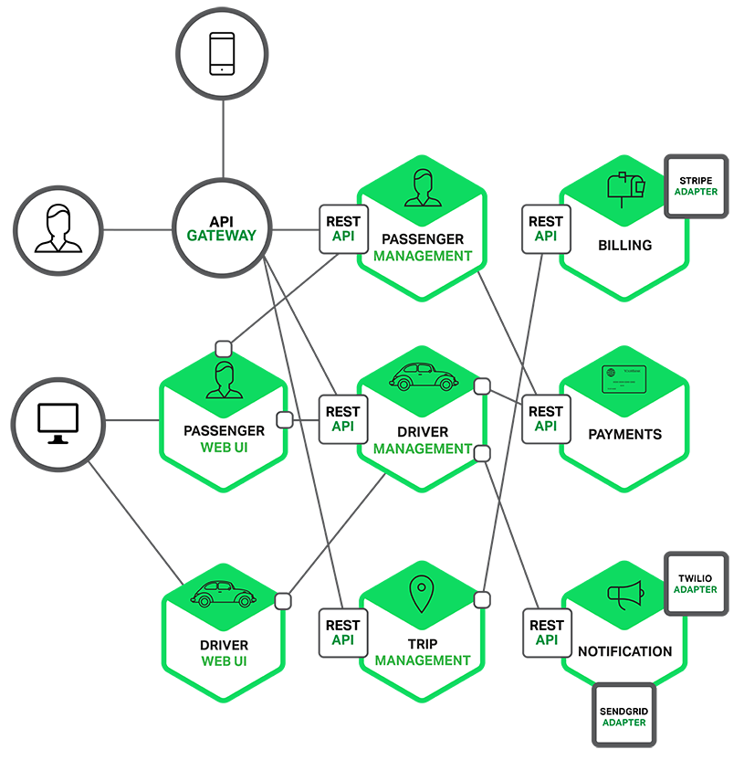
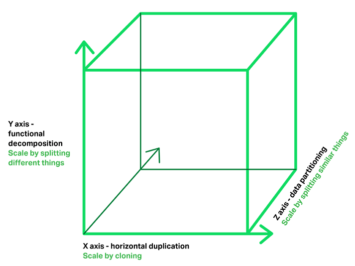
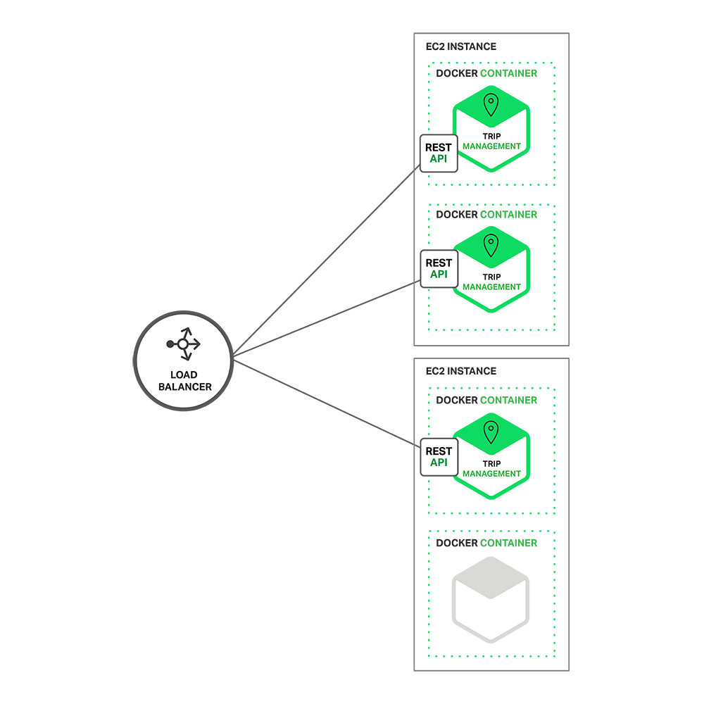
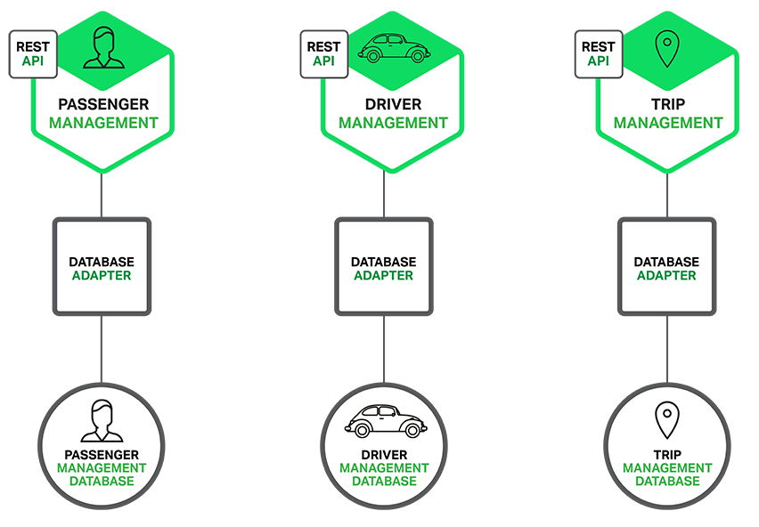
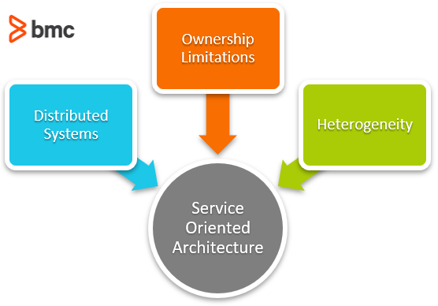
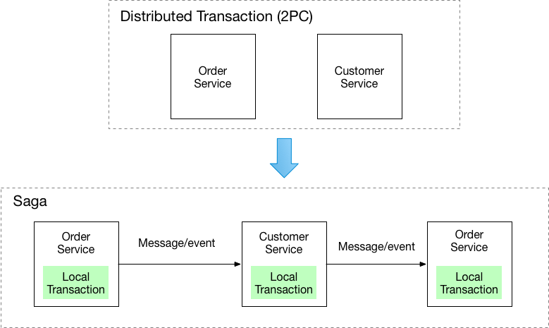

# Microservices

## Monolithic Architecture

### How it works

A monolithic application packages all functionality – business logic, database access, messaging, UI – into a single deployable unit (e.g., a WAR file, a Rails directory hierarchy).

At the core is the business logic, surrounded by adapters that interface with the outside world: database access components, messaging components, and web/API components. Despite being logically modular, the entire application is deployed as one unit.

### Benefits of Monolithic Architecture

- **Simple to develop** – IDEs and tooling are built around single-application development.
- **Simple to test** – end-to-end tests can launch the whole app and test the UI directly.
- **Simple to deploy** – copy the packaged artifact to a server.
- **Simple to scale** – run multiple identical copies behind a load balancer.

Works well in the early stages of a project.

### Drawbacks of Monolithic Architecture (Monolithic Hell)

As the application grows, the simplicity disappears:

- **Overwhelming complexity** – no single developer can fully understand the codebase. Bugs are hard to fix and features hard to add correctly. A downward spiral: hard to understand → changes made incorrectly → quality declines.
- **Slow IDE and startup times** – large codebases slow down tooling. Startup times of 12–40 minutes have been reported, significantly hurting developer productivity.
- **Continuous deployment is blocked** – any change requires redeploying the entire application, increasing risk and discouraging frequent releases.
- **Limited scalability** – can only scale in one dimension (more copies). Different modules with conflicting resource needs (CPU-intensive vs. memory-intensive) must run on the same hardware.
- **Reliability risk** – a bug (e.g., a memory leak) in one module can bring down the entire process for all users.
- **Technology lock-in** – rewriting even one part to use a newer framework often requires rewriting the entire application.

---

## Microservice Architecture

### How it works

Instead of one large application, the system is split into a set of small, independently deployable services. Each service:

- Implements a focused area of functionality (e.g., order management, customer management).
- Has its own hexagonal architecture (business logic and adapters).
- Has its own database (database-per-service pattern).
- Communicates via REST APIs or asynchronous messaging.

Each service instance typically runs as a Docker container on a cloud VM. An **API Gateway** sits in front, handling load balancing, caching, access control, metering, and monitoring – clients never talk directly to backend services.

### The Scale Cube

Microservices correspond to **Y-axis scaling** on the Scale Cube:

| Axis       | Description                                                                           |
|------------|---------------------------------------------------------------------------------------|
| **X-axis** | Run multiple identical copies behind a load balancer.                                 |
| **Y-axis** | Decompose the application by function – microservices.                                |
| **Z-axis** | Partition data by request attribute (e.g. customer ID) to route to a specific server. |

Applications typically use all three together.

### Deployment example (Docker on EC2)

Multiple instances of a service run as Docker containers across cloud VMs, with a load balancer (e.g., NGINX) in front distributing traffic.

### Database architecture

Each service owns its own database schema – **polyglot persistence**: each service can use the database type best suited to its needs (e.g., a geo-query-optimized database for driver location lookups).

This approach causes some data duplication and conflicts with a unified enterprise data model, but is essential for loose coupling between services.

### Benefits of Microservice Architecture

- **Tackles complexity** – each service is small, has a well-defined API boundary, and is easier to understand, develop, and maintain.
- **Independent development** – each service can be owned and developed by a small, focused team using whatever technology stack makes sense.
- **Independent deployment** – services are deployed independently; no coordination required for changes local to one service. Enables true continuous deployment.
- **Independent scaling** – each service can be scaled to meet its own capacity needs on hardware that matches its resource requirements (e.g., CPU-optimized for image processing, memory-optimized for caching).
- **Improved fault isolation** – a failure in one service does not cascade to bring down the entire system.
- **No long-term technology commitment** – new services can be written with new technology; old services can be rewritten when needed.

### Drawbacks of Microservice Architecture

- **Distributed system complexity** – inter-process communication, partial failure handling, and distributed transactions all require explicit design and code.
- **Partitioned database** – cross-service business transactions cannot use a single ACID transaction. Requires eventual consistency approaches (e.g., the Saga pattern).
- **Testing complexity** – testing a service requires launching it along with all its dependencies (or stubs for them).
- **Cross-service changes require coordination** – a change spanning services A → B → C must be carefully planned and rolled out in order.
- **Deployment complexity** – many services, each with multiple instances, need to be configured, deployed, scaled, and monitored. Requires mature automation (Kubernetes, Docker, PaaS).
- **Increased memory consumption** – N monolithic instances become N×M service instances, each with its own runtime overhead.

---

## Monolithic vs. Microservices – Summary

| Concern                | Monolithic                          | Microservices                              |
|------------------------|-------------------------------------|--------------------------------------------|
| Development simplicity | High (initially)                    | Lower – distributed system overhead        |
| Deployment             | Single artifact                     | Many independent deployments               |
| Scalability            | X-axis only (copies)                | X + Y + Z axes                             |
| Fault isolation        | Poor – one bug can crash everything | Good – failures are contained              |
| Technology flexibility | Low – stack locked in at start      | High – per-service choice                  |
| Continuous deployment  | Hard – full redeploy required       | Easy – deploy one service at a time        |
| Testing                | Simple end-to-end                   | Complex – must manage service dependencies |
| Suitable for           | Simple, early-stage applications    | Complex, evolving, large-team applications |

---

## Service-Oriented Architecture (SOA)

SOA is a design paradigm where software components behave as **separate, autonomous, loosely coupled, network-accessible units** that communicate via standardized protocols.

**Loose coupling** means a client service can communicate with another service without being tightly bound to it – it only depends on a defined interface, not the implementation, language, or platform behind it.

**Key drivers of SOA:**

- **Distributed systems** – components are spread across networks; standardized interfaces (APIs, OSI protocols) allow them to communicate regardless of vendor or technology.
- **Ownership limitations** – in cloud environments, customers cannot modify cloud infrastructure; services must interoperate without requiring control of underlying components.
- **Heterogeneity** – large systems are built over time with different languages, frameworks, and platforms. SOA enables interoperability across this diversity, avoiding vendor lock-in.

**Microservices vs. SOA:** Microservices can be seen as SOA without the heavyweight WS-* specifications and Enterprise Service Bus (ESB). Microservices favor lightweight REST over WS-*, implement ESB-like functionality within individual services, and reject the concept of a canonical schema.

---

## Pattern: Saga

### Context

In a microservices architecture with database-per-service, some business transactions span multiple services. These cannot use a single local ACID transaction.

### Problem

How to implement transactions that span multiple services? (2PC - a two-phase commit - is not an option.)

### Solution

Implement each multiservice business transaction as a **saga** – a sequence of local transactions. Each local transaction updates its own database and publishes an event or message to trigger the next step. If a step fails, the saga executes **compensating transactions** to undo the changes made by preceding steps.

### Two coordination approaches

**1. Choreography** – each service listens for events and reacts by executing its local transaction and emitting the next event. No central coordinator.

Example flow (order creation):
1. Order Service receives `POST /orders` → creates Order in `PENDING` state → emits `OrderCreated` event.
2. Customer Service reserves credit → emits outcome event.
3. Order Service approves or rejects the Order based on the outcome.

**2. Orchestration** – a central saga orchestrator tells each service what to do and handles the overall flow.

Example flow (order creation):
1. Order Service receives `POST /orders` → creates the saga orchestrator.
2. Orchestrator creates Order in `PENDING` state → sends `ReserveCredit` command to Customer Service.
3. Customer Service attempts to reserve credit → replies with an outcome.
4. Orchestrator approves or rejects the Order.

---

## Pattern: Circuit Breaker

### Context

In synchronous inter-service communication, a slow or unavailable downstream service can cause the calling service to exhaust its thread pool waiting for responses, eventually cascading the failure to other services.

### Problem

How to prevent a network or service failure from cascading to other services?

### Solution

Wrap remote calls in a **circuit breaker proxy** that behaves like an electrical circuit breaker:

- **Closed (normal)** – requests pass through; failures are counted.
- **Open (tripped)** – when consecutive failures exceed a threshold, the circuit opens; all calls fail immediately without hitting the remote service.
- **Half-open (recovery)** – after a timeout, a limited number of test requests are allowed through. If they succeed, the circuit closes again; if they fail, the timeout resets.

### Benefits and issues

- **Benefit**: Services fail fast instead of waiting, freeing up resources and preventing cascading failures.
- **Issue**: Choosing appropriate timeout values is challenging – too short causes false positives; too long introduces unnecessary latency.