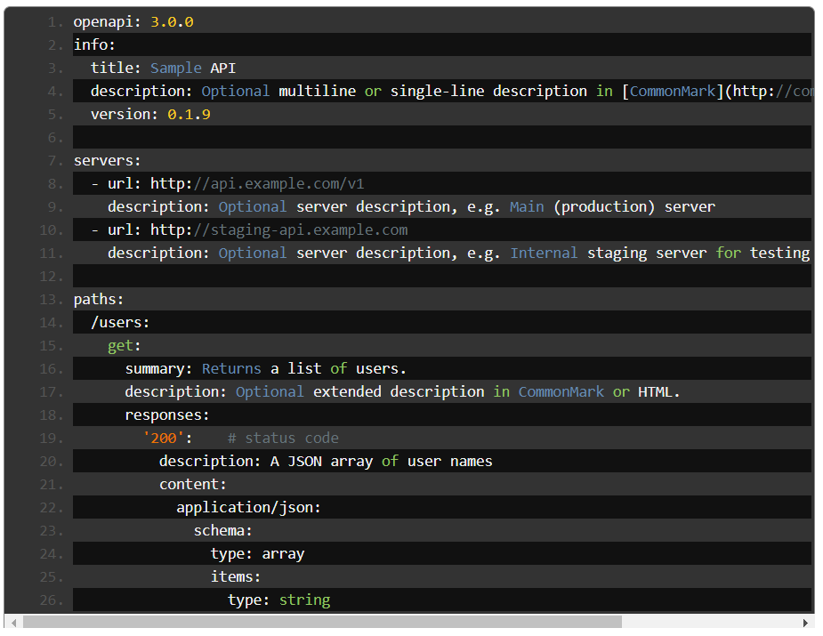
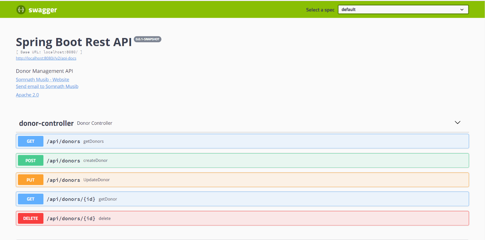
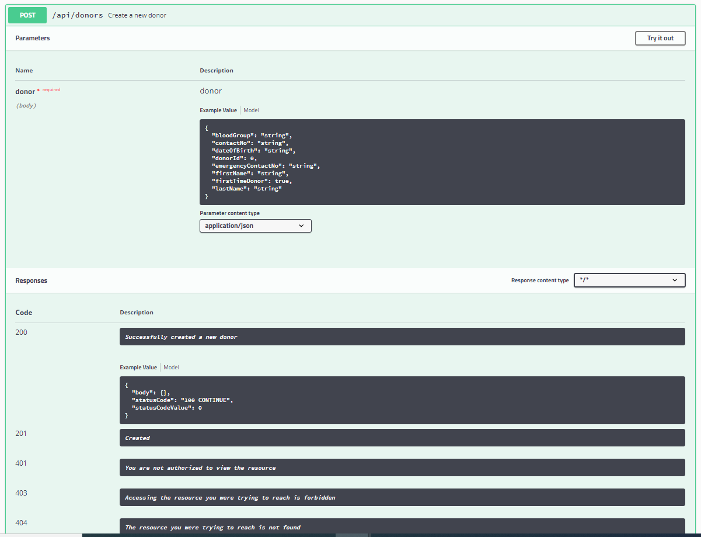
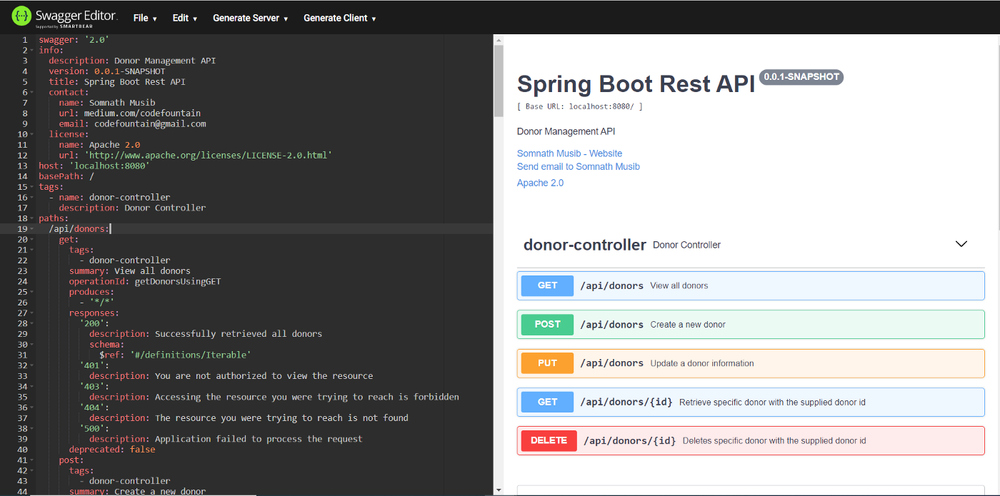
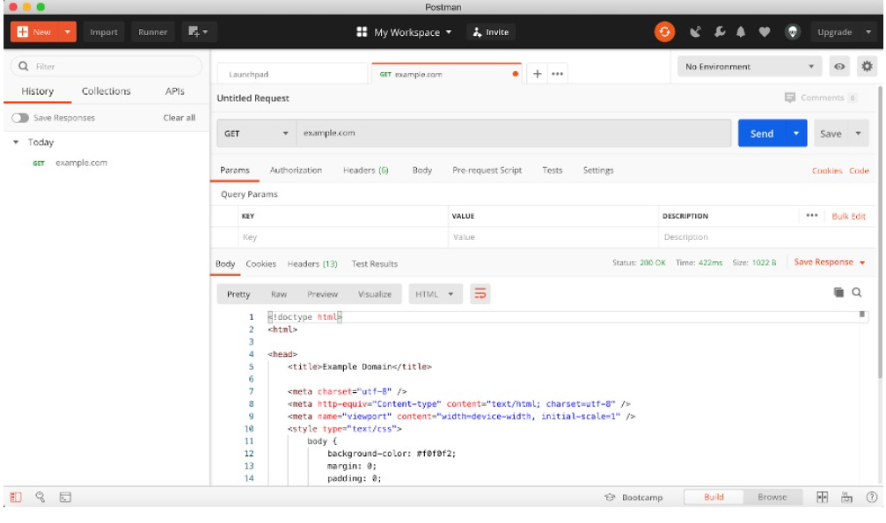
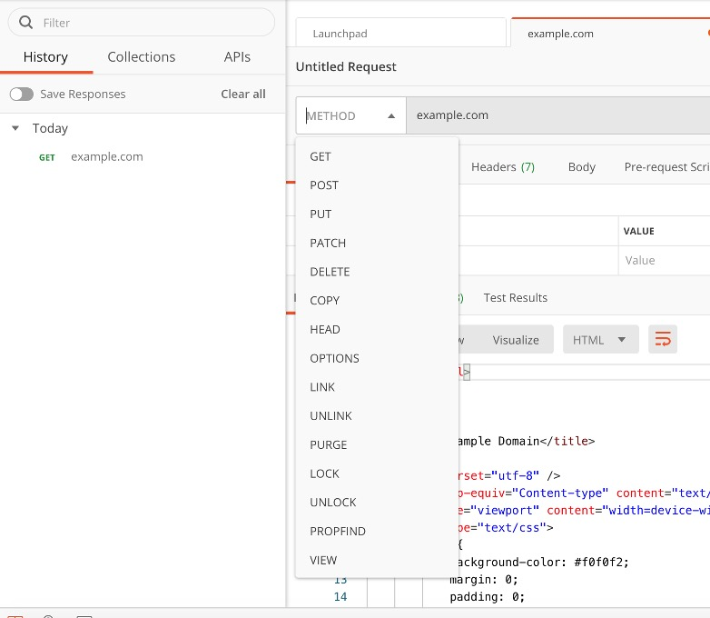
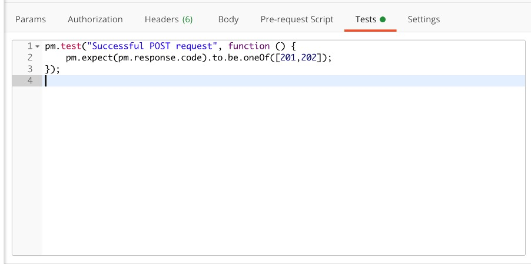

# REST API Documenting/Testing Tools

## Swagger and OpenAPI

### Overview

Swagger and the OpenAPI Specification let you design and develop REST APIs in an effortless and seamless manner. These specifications allow you to describe the structure of an entire REST API so that machines can read and mock them.

---

### OpenAPI Specification

OpenAPI Specification (previously known as the Swagger Specification) is an API description format for REST APIs. An OpenAPI-compatible file allows you to describe a complete REST API and is generally written in YAML or JSON.

It can describe:

- All available API endpoints (e.g. `/users`, `/users/{id}`)
- Operations on endpoints (e.g. `GET /users`, `POST /user`)
- Input and output parameters for each operation
- Authentication mechanisms
- Contact information, API license, terms of use, and other metadata

---

### Swagger

Swagger is a set of open-source tools built around the OpenAPI Specification that help you design, build, document, and consume REST APIs. The ability of APIs to describe their own structure is the foundation of Swagger's power - it not only helps with design and documentation, but also with building server stubs and generating REST clients.

The major Swagger tools include:

- **Swagger Editor** - browser-based editor for writing OpenAPI specifications.
- **Swagger UI** - renders OpenAPI specs as interactive API documentation.
- **Swagger Codegen** - generates server stubs and client libraries from an OpenAPI specification.



---

### Swagger in Action

To enable Swagger in a RESTful Spring application, add the following dependencies:

```groovy
implementation group: 'io.springfox', name: 'springfox-swagger2', version: '3.0.0'
implementation group: 'io.springfox', name: 'springfox-swagger-ui', version: '3.0.0'
```

Add a Swagger configuration class:

```java
@Configuration
@EnableSwagger2
public class SwaggerConfiguration {

    @Bean
    public Docket api() {
        return new Docket(DocumentationType.SWAGGER_2)
                .select()
                .apis(RequestHandlerSelectors.basePackage("mjc.newsapplication.controller"))
                .paths(PathSelectors.any())
                .build()
                .apiInfo(apiEndPointInfo());
    }

    public ApiInfo apiEndPointInfo() {
        return new ApiInfoBuilder()
                .title("Application Rest API")
                .description("News Application API")
                .contact(new Contact("MJC Supervisor", "mjc/finalexam", "mjc@epam.com"))
                .license("Apache 2.0")
                .licenseUrl("http://www.apache.org/licenses/LICENSE-2.0.html")
                .version("0.0.1-SNAPSHOT")
                .build();
    }
}
```

This class adds metadata (API name, author, license, etc.) and instructs Swagger to generate documentation only for components in the `mjc.newsapplication.controller` package.

The generated documentation is rendered via Swagger UI at:

```
http://localhost:8080/swagger-ui.html#/news-controller
```



By default, Swagger includes:

- Document metadata (API name, license, website, contact, etc.)
- All REST endpoints with information inferred from the code (endpoint descriptions default to method names)

---

### Documenting a REST Controller

Swagger provides annotations to enrich the generated documentation. Use `@Api` on the controller class, `@ApiOperation` on each endpoint, and `@ApiResponses` / `@ApiResponse` to describe the possible HTTP responses:

```java
@RestController
@RequestMapping("/api/v1/news")
@Api(produces = "application/json", value = "Operations for creating, updating, retrieving and deleting news")
public class NewsController {

    @Autowired
    private NewsService newsService;

    @PostMapping
    @ApiOperation(value = "Create a piece of news", response = News.class)
    @ApiResponses(value = {
        @ApiResponse(code = 201, message = "Successfully created a piece of news"),
        @ApiResponse(code = 401, message = "You are not authorized to view the resource"),
        @ApiResponse(code = 403, message = "Accessing the resource you were trying to reach is forbidden"),
        @ApiResponse(code = 404, message = "The resource you were trying to reach is not found"),
        @ApiResponse(code = 500, message = "Application failed to process the request")
    })
    @ResponseStatus(HttpStatus.CREATED)
    public News createNews(@RequestBody News news) {
        return newsService.save(news);
    }

    @GetMapping
    @ApiOperation(value = "View all news", response = List.class)
    @ApiResponses(value = {
        @ApiResponse(code = 200, message = "Successfully retrieved all news"),
        @ApiResponse(code = 401, message = "You are not authorized to view the resource"),
        @ApiResponse(code = 403, message = "Accessing the resource you were trying to reach is forbidden"),
        @ApiResponse(code = 404, message = "The resource you were trying to reach is not found"),
        @ApiResponse(code = 500, message = "Application failed to process the request")
    })
    public List<News> getNews() {
        return newsService.findAll();
    }

    @GetMapping("/{id}")
    @ApiOperation(value = "Retrieve specific news with the supplied id", response = News.class)
    @ApiResponses(value = {
        @ApiResponse(code = 200, message = "Successfully retrieved the news with the supplied id"),
        @ApiResponse(code = 401, message = "You are not authorized to view the resource"),
        @ApiResponse(code = 403, message = "Accessing the resource you were trying to reach is forbidden"),
        @ApiResponse(code = 404, message = "The resource you were trying to reach is not found"),
        @ApiResponse(code = 500, message = "Application failed to process the request")
    })
    public News getNewsById(@PathVariable("id") Long id) {
        return newsService.findById(id);
    }

    @PutMapping("/{id}")
    @ApiOperation(value = "Update a piece of news information", response = News.class)
    @ApiResponses(value = {
        @ApiResponse(code = 200, message = "Successfully updated news information"),
        @ApiResponse(code = 401, message = "You are not authorized to view the resource"),
        @ApiResponse(code = 403, message = "Accessing the resource you were trying to reach is forbidden"),
        @ApiResponse(code = 404, message = "The resource you were trying to reach is not found"),
        @ApiResponse(code = 500, message = "Application failed to process the request")
    })
    public News updateNews(@PathVariable("id") Long id, @RequestBody News news) {
        return newsService.update(news);
    }

    @DeleteMapping("/{id}")
    @ApiOperation(value = "Delete specific news with the supplied id")
    @ApiResponses(value = {
        @ApiResponse(code = 200, message = "Successfully deleted the specific news"),
        @ApiResponse(code = 401, message = "You are not authorized to view the resource"),
        @ApiResponse(code = 403, message = "Accessing the resource you were trying to reach is forbidden"),
        @ApiResponse(code = 404, message = "The resource you were trying to reach is not found"),
        @ApiResponse(code = 500, message = "Application failed to process the request")
    })
    @ResponseStatus(HttpStatus.NO_CONTENT)
    public void delete(@PathVariable("id") Long id) {
        newsService.deleteById(id);
    }
}
```

After restarting the application, the documentation at `http://localhost:8080/swagger-ui.html#/news-controller` will now include detailed response code descriptions:



---

### Swagger Editor

Swagger generates API documentation in JSON format adhering to the OpenAPI specification. This JSON can be shared with consumers so they can read endpoint information and generate client or server stubs.

The raw JSON documentation for your application is available at:

```
http://localhost:8080/v2/api-docs
```

This document conforms to the OpenAPI specification and can be loaded directly into the Swagger Editor:



---

### Stubbing with Swagger Codegen

Swagger Codegen generates server stubs and client SDKs from a supplied OpenAPI document. It currently supports:

- Server stub generation in over 20 languages.
- Client SDK generation in over 40 languages.

Swagger Codegen can be accessed via the Command Line Interface (codegen-cli) or the Maven/Gradle plugin. The CLI JAR can be downloaded from [Maven Central](https://search.maven.org/classic/remotecontent?filepath=io/swagger/swagger-codegen-cli/2.2.3/swagger-codegen-cli-2.2.3.jar).

Using the JAR you can generate a server stub from an OpenAPI document. This stub can be used for mocking and testing endpoints - a common scenario when the API provider has shared documentation but the consumer does not have access to the provider's infrastructure.

---

## REST Assured

REST Assured is one of the most widely used Java libraries for REST API automation testing. It behaves like a headless HTTP client, allowing you to create highly customizable HTTP requests to send to a RESTful server. This enables testing a wide variety of request combinations and core business logic scenarios.

REST Assured also provides the ability to validate HTTP responses, including status codes, status messages, headers, and response bodies.

REST Assured fully supports all HTTP methods: `GET`, `PUT`, `POST`, `PATCH`, and `DELETE`, and works well with both JSON and XML-based web services.

### How to Write a REST API Test Using REST Assured

The general steps are:

1. Use the `RestAssured` class to set the base URI.
2. Build a `RequestSpecification` (e.g., set headers).
3. Specify the HTTP method and send the request.
4. Receive the `Response` from the server.
5. Assert the status code and response body.

```java
public class RestAssuredAPITest {

    private final String SECURITY_TOKEN = "eyJhbGciOiJIUzI1NiIsInR5cCI6IkpXVCJ9...";
    private final String BASE_URI = "http://localhost:8080";
    private final String REQUEST_MAPPING_URI = "/api/v1/news";
    private final String EXPECTED_NEWS_CONTENT = "Financial News";
    private final ObjectMapper mapper = new ObjectMapper();

    private int newsID;

    @Autowired
    private NewsService newsService;

    @BeforeEach
    void setUp() {
        // Create a piece of news for testing purposes
        News news = new News(EXPECTED_NEWS_CONTENT);
        News createdNews = newsService.create(news);
        newsID = createdNews.getId();
    }

    @AfterEach
    void tearDown() {
        // Clean up after each test
        newsService.delete(newsID);
    }

    @Test
    public void getAllNewsTest() {
        final int EXPECTED_STATUS_CODE = 200;

        RestAssured.baseURI = BASE_URI + REQUEST_MAPPING_URI;

        RequestSpecification httpRequest = RestAssured.given()
                .header("Authorization", "Bearer " + SECURITY_TOKEN)
                .header("Content-Type", "application/json");

        Response response = httpRequest.request(Method.GET, "");

        String responseBodyAsString = response.asString();

        assertEquals(EXPECTED_STATUS_CODE, response.getStatusCode());
        assertNotNull(responseBodyAsString);
    }

    @Test
    public void getNewsByIdTest() throws Exception {
        final int EXPECTED_STATUS_CODE = 200;

        RestAssured.baseURI = BASE_URI;

        RequestSpecification httpRequest = RestAssured.given()
                .header("Authorization", "Bearer " + SECURITY_TOKEN)
                .header("Content-Type", "application/json");

        Response response = httpRequest.get(REQUEST_MAPPING_URI + "/" + newsID);

        String responseBodyAsString = response.asString();
        News news = mapper.readValue(responseBodyAsString, News.class);

        assertEquals(EXPECTED_STATUS_CODE, response.getStatusCode());
        assertEquals(newsID, news.getId());
        assertEquals(EXPECTED_NEWS_CONTENT, news.getContent());
    }

    @Test
    public void createNewsTest() throws Exception {
        final int EXPECTED_STATUS_CODE = 201;
        final String EXPECTED_CONTENT_OF_NEWLY_CREATED_NEWS = "Political News";

        RestAssured.baseURI = BASE_URI;

        RequestSpecification httpRequest = RestAssured.given()
                .header("Authorization", "Bearer " + SECURITY_TOKEN)
                .header("Content-Type", "application/json");

        News newsToCreate = new News(EXPECTED_CONTENT_OF_NEWLY_CREATED_NEWS);
        String newsAsJson = mapper.writeValueAsString(newsToCreate);

        Response response = httpRequest.body(newsAsJson).post(REQUEST_MAPPING_URI);

        String responseBodyAsString = response.asString();
        News createdNews = mapper.readValue(responseBodyAsString, News.class);

        assertEquals(EXPECTED_STATUS_CODE, response.getStatusCode());
        assertNotNull(createdNews.getId());
        assertEquals(EXPECTED_CONTENT_OF_NEWLY_CREATED_NEWS, createdNews.getContent());

        // Clean up the newly created news
        newsService.delete(createdNews.getId());
    }

    @Test
    public void updateNewsTest() throws Exception {
        final int EXPECTED_STATUS_CODE = 200;
        final String EXPECTED_NEWS_CONTENT_AFTER_UPDATE = "Updated Financial News";

        RestAssured.baseURI = BASE_URI;

        RequestSpecification httpRequest = RestAssured.given()
                .header("Authorization", "Bearer " + SECURITY_TOKEN)
                .header("Content-Type", "application/json");

        News newsWithNewContent = new News(newsID, EXPECTED_NEWS_CONTENT_AFTER_UPDATE);
        String newsWithNewContentAsJson = mapper.writeValueAsString(newsWithNewContent);

        Response response = httpRequest
                .body(newsWithNewContentAsJson)
                .put(REQUEST_MAPPING_URI + "/" + newsID);

        String responseBodyAsString = response.asString();
        News updatedNews = mapper.readValue(responseBodyAsString, News.class);

        assertEquals(EXPECTED_STATUS_CODE, response.getStatusCode());
        assertEquals(newsID, updatedNews.getId());
        assertEquals(EXPECTED_NEWS_CONTENT_AFTER_UPDATE, updatedNews.getContent());
    }

    @Test
    public void deleteNewsTest() {
        final int EXPECTED_STATUS_CODE = 204;

        RestAssured.baseURI = BASE_URI;

        RequestSpecification httpRequest = RestAssured.given()
                .header("Authorization", "Bearer " + SECURITY_TOKEN);

        Response response = httpRequest.delete(REQUEST_MAPPING_URI + "/" + newsID);

        assertEquals(EXPECTED_STATUS_CODE, response.getStatusCode());
    }
}
```

More information: [REST Assured Library - ToolsQA](https://www.toolsqa.com/rest-assured/rest-assured-library/)

---

## Postman for Testing REST APIs

Postman provides a graphical user interface for generating, sending, and validating HTTP requests to a server. It is widely used for testing REST APIs of any complexity.



The interface makes it straightforward to select the request method type:



Postman-level automation supports the following capabilities:

- Saving and organizing tests into collections.
- Writing test scripts in JavaScript.
- Modifying tests across old and new API versions.
- Extracting data from JSON and XML response objects.
- Managing environment variables.
- Running a test multiple times with different data.
- Loading test data from external files.
- Generating large volumes of unique test data.

Postman also supports writing JavaScript test scripts, with clear examples available in the [official Postman documentation](https://www.baeldung.com/postman-testing-collections):



More information: [Postman Testing Collections - Baeldung](https://www.baeldung.com/postman-testing-collections)