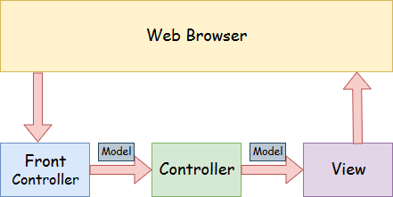
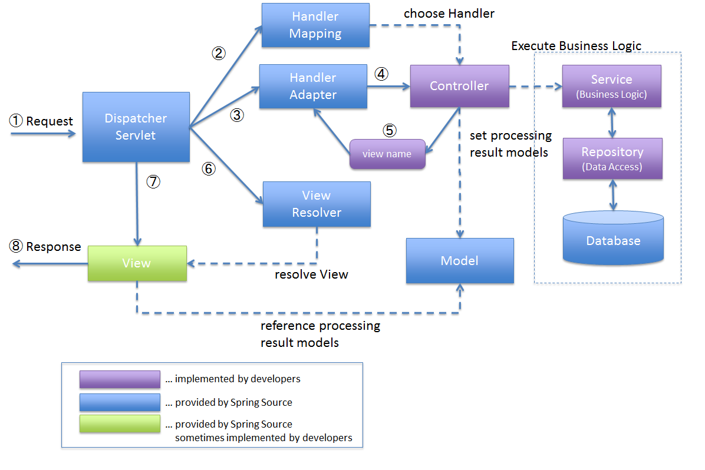
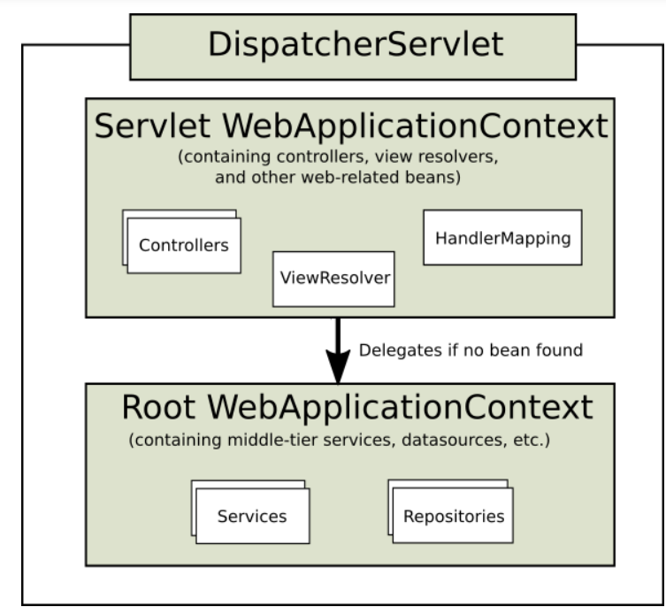

# REST with Spring

## Spring Web Annotations

- `@Controller`
- `@RestController`
- `@RequestMapping`
- `@RequestBody`
- `@PathVariable`
- `@RequestParam`
- `@RequestHeader`
- `@CookieValue`
- `@ResponseBody`
- `@ExceptionHandler`
- `@ResponseStatus`
- `@ModelAttribute`
- `@CrossOrigin`

---

### `@Controller`

A class-level annotation that tells the Spring Framework this class serves as a controller in Spring MVC:

```java
@Controller
@ResponseBody
@ResponseStatus(HttpStatus.OK)
public class BookController {

    @RequestMapping(value = "/books", method = RequestMethod.GET)
    @ResponseBody
    @ResponseStatus(HttpStatus.OK)
    List<Book> getAllBooks() {
        return new ResponseEntity<>(bookService.getAllBooks(), HttpStatus.OK);
    }
}
```

---

### `@RestController`

`@RestController` combines `@Controller` and `@ResponseBody`. By annotating the controller class with `@RestController`, you no longer need to add `@ResponseBody` to every request mapping method - it is active by default. The following two declarations are equivalent:

```java
@Controller
@ResponseBody
public class BookController {

    @Autowired
    private BookService bookService;

    @RequestMapping(value = "/books", method = RequestMethod.GET)
    @ResponseStatus(HttpStatus.OK)
    List<Book> getAllBooks() {
        return new ResponseEntity<>(bookService.getAllBooks(), HttpStatus.OK);
    }
}
```

```java
@RestController
public class BookController {

    @Autowired
    private BookService bookService;

    @RequestMapping(value = "/books", method = RequestMethod.GET)
    @ResponseStatus(HttpStatus.OK)
    List<Book> getAllBooks() {
        return new ResponseEntity<>(bookService.getAllBooks(), HttpStatus.OK);
    }
}
```

---

### `@RequestMapping`

Marks request handler methods inside `@Controller` / `@RestController` classes. It can be configured using:

- `path` (or its aliases `name` and `value`) - the URL the method is mapped to.
- `method` - compatible HTTP methods.
- `params` - filters requests based on the presence, absence, or value of HTTP parameters.
- `headers` - filters requests based on the presence, absence, or value of HTTP headers.
- `consumes` - the media types the method can consume in the HTTP request body.
- `produces` - the media types the method can produce in the HTTP response body.

Example - Spring MVC controller returning a view name:

```java
@Controller
public class BookController {

    @Autowired
    private BookService bookService;

    @RequestMapping(value = "/books", method = RequestMethod.GET)
    String getAllBooks(Model model) {
        model.addAttribute("bookList", bookService.getAllBooks());
        return "books";
    }
}
```

Example - Spring REST controller returning a `ResponseEntity`:

```java
@RestController
public class BookController {

    @Autowired
    private BookService bookService;

    @RequestMapping(value = "/books", method = RequestMethod.GET)
    ResponseEntity<List<Book>> getAllBooks() {
        return new ResponseEntity<>(bookService.getAllBooks(), HttpStatus.OK);
    }
}
```

You can provide default settings for all handler methods by applying `@RequestMapping` at the class level. The URL is not overridden by method-level settings - instead, the two path parts are appended. For example:

```java
@RestController
@RequestMapping(value = "/books")
public class BookController {

    @Autowired
    private BookService bookService;

    @RequestMapping(method = RequestMethod.GET)
    ResponseEntity<List<Book>> getAllBooks() {
        return new ResponseEntity<>(bookService.getAllBooks(), HttpStatus.OK);
    }

    @RequestMapping(value = "/{id:\\d+}", method = RequestMethod.GET)
    ResponseEntity<Book> getBookById(@PathVariable long id) {
        return new ResponseEntity<>(bookService.getBookById(id), HttpStatus.OK);
    }
}
```

You can use regular expressions in the `value` property:

```java
@RestController
@RequestMapping(value = "/books", produces = {"application/JSON", "application/XML"})
public class BookController {

    @Autowired
    private BookService bookService;

    @RequestMapping(method = RequestMethod.GET)
    ResponseEntity<List<Book>> getAllBooks() {
        return new ResponseEntity<>(bookService.getAllBooks(), HttpStatus.OK);
    }

    @RequestMapping(value = "/{id:\\d+}", method = RequestMethod.GET)
    ResponseEntity<Book> getBookById(@PathVariable long id) {
        return new ResponseEntity<>(bookService.getBookById(id), HttpStatus.OK);
    }
}
```

There are shorthand variants with the HTTP method already set: `@GetMapping`, `@PostMapping`, `@PutMapping`, `@DeleteMapping`, and `@PatchMapping`:

```java
@RestController
@RequestMapping(value = "/books", consumes = {"application/JSON"}, produces = {"application/JSON", "application/XML"})
public class BookController {

    @Autowired
    private BookService bookService;

    @Autowired
    private Convertor<BookDTO, Book> convertor;

    @GetMapping
    ResponseEntity<List<BookDTO>> getAllBooks() {
        List<Book> bookList = bookService.getAllBooks();
        List<BookDTO> bookDTOList = convertor.convertModelListToDtoList(bookList);
        return new ResponseEntity<>(bookDTOList, HttpStatus.OK);
    }

    @GetMapping(value = "/{id:\\d+}")
    ResponseEntity<BookDTO> getBookById(@PathVariable long id) {
        Book book = bookService.getBookById(id);
        BookDTO bookDTO = convertor.convertModelToDto(book);
        return new ResponseEntity<>(bookDTO, HttpStatus.OK);
    }

    @PostMapping
    ResponseEntity<BookDTO> createBook(@RequestBody BookCreateDTO bookCreateDTO) {
        Book book = convertor.convertDtoToModel(bookCreateDTO);
        Book createdBook = bookService.createBook(book);
        return new ResponseEntity<>(convertor.convertModelToDto(createdBook), HttpStatus.CREATED);
    }

    @PutMapping(value = "/{id:\\d+}")
    ResponseEntity<BookDTO> updateBook(@PathVariable long id, @RequestBody BookUpdateDTO bookUpdateDTO) {
        Book book = convertor.convertDtoToModel(bookUpdateDTO);
        Book updatedBook = bookService.updateBook(book);
        return new ResponseEntity<>(convertor.convertModelToDto(updatedBook), HttpStatus.OK);
    }

    @PatchMapping(value = "/{id:\\d+}")
    ResponseEntity<BookDTO> patchBook(@PathVariable long id, @RequestBody BookPatchDTO bookPatchDTO) {
        Book book = convertor.convertDtoToModel(bookPatchDTO);
        Book patchedBook = bookService.patchBook(id, book);
        return new ResponseEntity<>(convertor.convertModelToDto(patchedBook), HttpStatus.OK);
    }

    @DeleteMapping(value = "/{id:\\d+}")
    ResponseEntity<Void> deleteBook(@PathVariable long id) {
        bookService.deleteBook(id);
        return new ResponseEntity<>(HttpStatus.NO_CONTENT);
    }
}
```

---

### `@RequestBody`

Maps the body of the HTTP request to a method parameter:

```java
@RestController
@RequestMapping(value = "/books", consumes = {"application/JSON"}, produces = {"application/JSON", "application/XML"})
public class BookController {

    @Autowired
    private BookService bookService;

    @Autowired
    private Convertor<BookDTO, Book> convertor;

    @PostMapping
    ResponseEntity<BookDTO> createBook(@RequestBody BookCreateDTO bookCreateDTO) {
        Book book = convertor.convertDtoToModel(bookCreateDTO);
        Book createdBook = bookService.createBook(book);
        return new ResponseEntity<>(convertor.convertModelToDto(createdBook), HttpStatus.CREATED);
    }

    @PutMapping(value = "/{id:\\d+}")
    ResponseEntity<BookDTO> updateBook(@PathVariable long id, @RequestBody BookUpdateDTO bookUpdateDTO) {
        if (bookUpdateDTO.getId() > 0 && bookUpdateDTO.getId() != id) {
            throw new BadRequestException("Resource id in path and request body does not match.");
        }
        if (bookUpdateDTO.getId() == 0) {
            bookUpdateDTO.setId(id);
        }
        Book book = convertor.convertDtoToModel(bookUpdateDTO);
        Book updatedBook = bookService.updateBook(book);
        return new ResponseEntity<>(convertor.convertModelToDto(updatedBook), HttpStatus.OK);
    }

    @PatchMapping(value = "/{id:\\d+}")
    ResponseEntity<BookDTO> patchBook(@PathVariable long id, @RequestBody BookPatchDTO bookPatchDTO) {
        Book book = convertor.convertDtoToModel(bookPatchDTO);
        Book patchedBook = bookService.patchBook(id, book);
        return new ResponseEntity<>(convertor.convertModelToDto(patchedBook), HttpStatus.OK);
    }
}
```

---

### `@PathVariable`

Binds a method argument to a URI template variable. If the template part name matches the method argument name, you do not need to specify it explicitly:

```java
@GetMapping(value = "/{id:\\d+}")
ResponseEntity<BookDTO> getBookById(@PathVariable long id) {
    // ...
}
```

If the names do not match, specify the template name in the annotation:

```java
@GetMapping(value = "/{title}")
ResponseEntity<BookDTO> getBookByTitle(@PathVariable("title") String bookTitle) {
    // ...
}
```

You can also mark a path variable as optional (the default is `required = true`):

```java
@PutMapping(value = "/{id:\\d+}")
ResponseEntity<BookDTO> updateBook(@PathVariable(required = false) long id, @RequestBody BookUpdateDTO bookUpdateDTO) {
    // ...
}
```

---

### `@RequestParam`

Extracts values from the HTTP query string.

Example URI: `http://localhost:8080/bookshop/books?author=Conan+Doyle&limit=10`

You can specify a default value using `defaultValue`, which also implicitly sets `required = false`:

```java
@GetMapping
ResponseEntity<List<BookDTO>> getBooksByAuthor(
        @RequestParam("author") String authorName,
        @RequestParam(defaultValue = "5", required = false) int limit) {
    // ...
}
```

> Besides query parameters, you can access cookies and headers with `@CookieValue` and `@RequestHeader`, which are configured the same way.

---

### `@RequestHeader`

Maps all or specific HTTP header values to a method argument.

Reading all headers into a `Map`:

```java
@GetMapping
ResponseEntity<List<BookDTO>> getAllBooks(
        @RequestHeader Map<String, String> headers,
        @RequestParam(defaultValue = "5", required = false) int limit) {
    // ...
}
```

Reading a specific header:

```java
@GetMapping
ResponseEntity<List<BookDTO>> getAllBooks(
        @RequestHeader(value = "content-type", required = false) String contentType,
        @RequestParam(defaultValue = "5", required = false) int limit) {
    // ...
}
```

---

### `@CookieValue`

Gets the value of a specific HTTP cookie and maps it to a controller method parameter:

```java
@RestController
@RequestMapping(value = "/info")
public class InfoController {

    @GetMapping
    public String getSessionInfo(@CookieValue("JSESSIONID") String jsessionid, Model model) {
        model.addAttribute("info", "JSESSIONID: " + jsessionid);
        return "sessionInfo";
    }
}
```

---

### `@ResponseBody`

Used together with `@Controller`. Tells Spring to treat the method's return value as the HTTP response body directly:

```java
@Controller
@RequestMapping(value = "/books", produces = {"application/JSON", "application/XML"})
public class BookController {

    @GetMapping
    @ResponseBody
    ResponseEntity<List<BookDTO>> getAllBooks(
            @RequestParam(defaultValue = "10", required = false) int limit,
            @RequestParam(defaultValue = "5", required = false) int offset) {
        // ...
    }
}
```

---

### `@ExceptionHandler`

Declares a custom error handler method. Spring calls this method when a request handler throws any of the specified exceptions. The caught exception can be passed as an argument:

```java
@Controller
@RequestMapping(value = "/books", produces = {"application/JSON", "application/XML"})
public class BookController {

    @GetMapping(value = "/{id}")
    ResponseEntity<BookDTO> getBookById(@PathVariable long id) {
        // ...
    }

    @ExceptionHandler(NoSuchResourceFoundException.class)
    public ResponseEntity<String> handleNoSuchResourceFoundException(NoSuchResourceFoundException exc) {
        return ResponseEntity
                .status(HttpStatus.NOT_FOUND)
                .body(exc.getMessage());
    }
}
```

---

### `@ResponseStatus`

Specifies the desired HTTP status code for a response. Can be used on handler methods or together with `@ExceptionHandler`:

```java
@RestController
@RequestMapping(value = "/books", produces = {"application/JSON", "application/XML"})
public class BookController {

    @Autowired
    private BookService bookService;

    @GetMapping(value = "/{id}")
    @ResponseStatus(HttpStatus.OK)
    BookDTO getBookById(@PathVariable long id) {
        if (bookService.getBookById(id) == null) {
            throw new NoSuchResourceFoundException();
        }
        // ...
    }

    @ExceptionHandler(NoSuchResourceFoundException.class)
    @ResponseStatus(HttpStatus.NOT_FOUND)
    public String handleNoSuchResourceFoundException(NoSuchResourceFoundException exc) {
        return exc.getMessage();
    }
}

@ResponseStatus(value = HttpStatus.NOT_FOUND)
public class ResourceNotFoundException extends RuntimeException {
}
```

---

### `@ModelAttribute`

Used in Spring MVC. Allows access to model attributes in a `@Controller`, or automatically adds a method's return value to the model:

```java
@Controller
@RequestMapping(value = "/books")
public class BookController {

    @Autowired
    private BookService bookService;

    @RequestMapping(method = RequestMethod.POST)
    String submitNewBook(@ModelAttribute("book") Book book) {
        bookService.createNewBook(book);
        return "newBookView";
    }

    @RequestMapping(value = "/{id}", method = RequestMethod.GET)
    @ModelAttribute("book")
    Book getBookById(@PathVariable long id) {
        return bookService.getBookById(id);
    }
}
```

Spring MVC automatically populates the `book` model attribute with form data before invoking `submitNewBook`. If you annotate a method with `@ModelAttribute`, Spring automatically adds the return value to the model.

---

### `@CrossOrigin`

Enables cross-domain communication for the annotated request handler methods:

```java
@CrossOrigin
@RestController
@RequestMapping(value = "/books")
public class BookController {

    @GetMapping(value = "/{id}")
    ResponseEntity<BookDTO> getBookById(@PathVariable long id) {
        // ...
    }
}
```

Default behavior when no attributes are specified:

- All origins are allowed.
- Allowed HTTP methods are those defined in the `@RequestMapping` annotation.
- Preflight response cache duration (`maxAge`) is 30 minutes.

---

## Spring MVC

### Overview

Spring MVC is a Java framework for building web applications following the Model-View-Controller design pattern. It implements core Spring features like Inversion of Control and Dependency Injection. The central piece is `DispatcherServlet`, which is fully integrated with the Spring IoC container and is responsible for receiving incoming requests and routing them to the correct controllers, models, and views.

### Model-View-Controller



- **Model** - Contains the data of the application (a single object or a collection).
- **Controller** - Contains the business logic. Marked with `@Controller`.
- **View** - Renders data in a specific format. Common technologies: JSP+JSTL, Thymeleaf, Apache Velocity, FreeMarker.
- **Front Controller** - `DispatcherServlet` acts as the front controller, managing the flow of the entire Spring MVC application.

### Request Lifecycle



1. `DispatcherServlet` receives the request.
2. `DispatcherServlet` delegates controller selection to `HandlerMapping`.
3. `HandlerMapping` selects the controller mapped to the incoming URL and returns it to `DispatcherServlet`.
4. `DispatcherServlet` delegates execution to `HandlerAdapter`.
5. `HandlerAdapter` calls the business logic of the controller.
6. The controller executes the logic, sets the result in the `Model`, and returns a logical view name to `HandlerAdapter`.
7. `DispatcherServlet` delegates view resolution to `ViewResolver`.
8. `ViewResolver` returns the `View` mapped to the view name.
9. `DispatcherServlet` dispatches rendering to the resolved `View`.
10. The `View` renders the model data and returns the response.

### References

- [Spring MVC Example Project](https://github.com/eugenp/tutorials/tree/master/spring-web-modules/spring-mvc-basics/src/main/webapp/WEB-INF/view)
- [Spring MVC Tutorial - Baeldung](https://www.baeldung.com/spring-mvc-tutorial)
- [Spring MVC and Java-Based Configuration - DZone](https://dzone.com/articles/spring-mvc-and-java-based-configuration-1)
- [Spring MVC using Java-Based Configuration - GeeksforGeeks](https://www.geeksforgeeks.org/spring-mvc-using-java-based-configuration/)

---

## REST with Spring

Spring supports two ways of creating RESTful services:

- Using MVC with `ModelAndView` - older, well-documented, but verbose and configuration-heavy.
- Using HTTP message converters and annotations - lightweight, easy to implement, minimal configuration, sensible defaults.

### REST Controllers

Spring REST controllers are annotated with `@RestController`, which combines `@Controller` and `@ResponseBody`:

```java
@RestController
@RequestMapping(value = "/books", consumes = {"application/JSON"}, produces = {"application/JSON", "application/XML"})
public class BookController {

    @Autowired
    private BookService bookService;

    @Autowired
    private Convertor<BookDTO, Book> convertor;

    @GetMapping
    ResponseEntity<List<BookDTO>> getAll(
            @RequestParam(defaultValue = "10", required = false) int limit,
            @RequestParam(defaultValue = "5", required = false) int offset) {
        List<Book> bookList = bookService.getAllBooks(limit, offset);
        List<BookDTO> bookDTOList = convertor.convertModelListToDtoList(bookList);
        return new ResponseEntity<>(bookDTOList, HttpStatus.OK);
    }

    @GetMapping(value = "/{id:\\d+}")
    ResponseEntity<BookDTO> getById(@PathVariable long id) {
        Book book = bookService.getBookById(id);
        BookDTO bookDTO = convertor.convertModelToDto(book);
        return new ResponseEntity<>(bookDTO, HttpStatus.OK);
    }

    @PostMapping
    ResponseEntity<BookDTO> create(@RequestBody BookCreateDTO bookCreateDTO) {
        Book book = convertor.convertDtoToModel(bookCreateDTO);
        Book createdBook = bookService.createBook(book);
        return new ResponseEntity<>(convertor.convertModelToDto(createdBook), HttpStatus.CREATED);
    }

    @PutMapping(value = "/{id:\\d+}")
    ResponseEntity<BookDTO> update(@PathVariable long id, @Valid @RequestBody BookUpdateDTO bookUpdateDTO) {
        Book book = convertor.convertDtoToModel(bookUpdateDTO);
        Book updatedBook = bookService.updateBook(book);
        return new ResponseEntity<>(convertor.convertModelToDto(updatedBook), HttpStatus.OK);
    }

    @PatchMapping(value = "/{id:\\d+}")
    ResponseEntity<BookDTO> patch(@PathVariable long id, @Valid @RequestBody BookPatchDTO bookPatchDTO) {
        Book book = convertor.convertDtoToModel(bookPatchDTO);
        Book patchedBook = bookService.patchBook(id, book);
        return new ResponseEntity<>(convertor.convertModelToDto(patchedBook), HttpStatus.OK);
    }

    @DeleteMapping(value = "/{id:\\d+}")
    ResponseEntity<Void> delete(@PathVariable long id) {
        bookService.deleteBook(id);
        return new ResponseEntity<>(HttpStatus.NO_CONTENT);
    }
}
```

`ResponseEntity` represents a full HTTP response including headers, body, and status code.

---

### Spring REST Application Configuration

Spring supports two configuration approaches:

- XML-based configuration (`web.xml`, `SpringApplicationContext.xml`).
- Java-based configuration (recommended).

#### Java-Based Web Configuration

```java
@Configuration
@EnableWebMvc
@ComponentScan(basePackages = {"com.epam.mjc.school"})
public class WebConfig {
    // Configure beans related to the web application context
}
```

- `@Configuration` - marks the class as a source of Spring bean definitions.
- `@EnableWebMvc` - enables Spring MVC support; in a REST context, auto-registers JSON (Jackson) and XML (JAXB 2) converters if they are on the classpath. Equivalent to `<mvc:annotation-driven />` in XML.
- `@ComponentScan` - scans the given package for controllers and beans.

To customize the configuration, implement `WebMvcConfigurer`:

```java
@Configuration
@EnableWebMvc
@ComponentScan(basePackages = {"com.epam.mjc.school"})
public class WebConfig implements WebMvcConfigurer {
    // Customize web application context beans
}
```

#### WebApplicationInitializer

Replaces `web.xml` for programmatic `ServletContext` configuration (Servlet 3.0+):

```java
public class MainWebAppInitializer implements WebApplicationInitializer {

    @Override
    public void onStartup(final ServletContext servletContext) throws ServletException {

        // Create the root Spring application context
        AnnotationConfigWebApplicationContext rootContext = new AnnotationConfigWebApplicationContext();
        rootContext.register(WebConfig.class);
        rootContext.setConfigLocation("com.epam.mjc.school.config");

        // Load the application context on startup
        servletContext.addListener(new ContextLoaderListener(rootContext));

        // Register and map the DispatcherServlet
        AnnotationConfigWebApplicationContext servletAppContext = new AnnotationConfigWebApplicationContext();
        servletAppContext.register(WebConfig.class);
        ServletRegistration.Dynamic dispatcher =
                servletContext.addServlet("dispatcher", new DispatcherServlet(servletAppContext));
        dispatcher.setLoadOnStartup(1);
        dispatcher.addMapping("/");

        // Add UTF-8 encoding filter
        FilterRegistration.Dynamic encodingFilter =
                servletContext.addFilter("encoding-filter", new CharacterEncodingFilter());
        encodingFilter.setInitParameter("encoding", "UTF-8");
        encodingFilter.setInitParameter("forceEncoding", "true");
        encodingFilter.addMappingForUrlPatterns(null, true, "/*");
    }
}
```

#### AbstractAnnotationConfigDispatcherServletInitializer

A simpler alternative that handles `ContextLoaderListener` and `DispatcherServlet` registration automatically:

```java
public class MainWebAppInitializer extends AbstractAnnotationConfigDispatcherServletInitializer {

    @Override
    protected Class<?>[] getRootConfigClasses() {
        return new Class<?>[] { SecurityConfig.class, ApplicationConfig.class, RepositoryConfig.class };
    }

    @Override
    protected Class<?>[] getServletConfigClasses() {
        return new Class<?>[] { WebConfig.class };
    }

    @Override
    protected String[] getServletMappings() {
        return new String[] { "/" };
    }

    @Override
    public void onStartup(ServletContext servletContext) throws ServletException {
        super.onStartup(servletContext);
        FilterRegistration.Dynamic encodingFilter =
                servletContext.addFilter("encoding-filter", new CharacterEncodingFilter());
        encodingFilter.setInitParameter("encoding", "UTF-8");
        encodingFilter.setInitParameter("forceEncoding", "true");
        encodingFilter.addMappingForUrlPatterns(null, true, "/*");
    }
}
```

#### Context Hierarchy

Each `DispatcherServlet` has its own `WebApplicationContext`, which inherits beans from the root `WebApplicationContext`. Inherited beans can be overridden in the servlet-specific scope.



---

### Versioning a REST API

There are four main approaches to versioning a REST API:

**1. URI Versioning** - include the version in the URL path:

```
http://host/v1/users
http://host/v2/users
```

**2. Accept Header Versioning** - use a custom MIME type in the `Accept` header:

```
Accept: application/vnd.javadevjournal.v2+json
Accept: application/vnd.javadevjournal+json;version=1.0
```

Example request/response:

```
GET /products/228781 HTTP/1.1
Accept: application/vnd.javadevjournal.v1+json

HTTP/1.1 200 OK
Content-Type: application/vnd.javadevjournal.v1+json

{
  "product": {
    "code": "228781",
    "name": "Running shoes",
    "description": "one of the best running shoes"
  }
}
```

**3. Custom Header Versioning** - pass the version in a custom request header:

```
Accept-version: v1
Accept-version: v2
```

**4. URI Parameter Versioning** - append the version as a query parameter:

```
http://host/shopping?version=2.0
http://host/catalog/titles/series/70023522?v=1.5
```

> If a client tries to use an outdated API version, the server should return HTTP `410 Gone`, indicating that the resource is permanently unavailable.

---

### REST Pagination in Spring

Pagination is a mechanism for handling large result sets. There are two perspectives on how to model it:

**Page as a property of the request:**
```
http://domainname/products?page=1
```

**Page as a resource:**
```
http://domainname/products/page/1?sort_by=date
http://domainname/products/date/page/1
```

#### Key Pagination Concepts

- **Page & Size/Limit** - control the number of results per page and which page to retrieve. APIs should provide a default limit but allow clients to override it.
- **Sorting** - use the `sort_by=[attribute]::[asc/desc]` pattern. Example: `?sort_by=name::asc`.
- **Discoverability** - include `first`, `prev`, `next`, and `last` links in the response (HATEOAS-style).

#### Pagination Controller Example

```java
@RestController
@RequestMapping("/books")
public class BookController {

    @Autowired
    private BookService bookService;

    @Autowired
    private BookMapper bookMapper;

    @Autowired
    private EntityLinks links;

    @GetMapping
    public ResponseEntity<PagedResources<BookDTO>> getAllBooks(
            @Min(1) @RequestParam int page,
            @RequestParam(required = false, defaultValue = "10") int size,
            @RequestParam(name = "sort_by", required = false, defaultValue = "title::asc") String sortBy,
            PagedResourcesAssembler<BookDTO> assembler) {

        Page<BookDTO> bookDTOPage = bookMapper.mapToBookDTOPage(bookService.findAllBooks(page, size, sortBy));
        PagedResources<BookDTO> bookDTOResources =
                assembler.toResource(bookDTOPage, linkTo(BookController.class).slash("/books").withSelfRel());

        HttpHeaders responseHeaders = new HttpHeaders();
        responseHeaders.add("Link", createLinkHeader(bookDTOResources));

        return new ResponseEntity<>(bookDTOResources, responseHeaders, HttpStatus.OK);
    }

    private String createLinkHeader(PagedResources<BookDTO> bookDTOResources) {
        final StringBuilder linkHeader = new StringBuilder();
        linkHeader.append(buildLinkHeader(bookDTOResources.getLinks("first").get(0).getHref(), "first"));
        linkHeader.append(", ");
        linkHeader.append(buildLinkHeader(bookDTOResources.getLinks("next").get(0).getHref(), "next"));
        return linkHeader.toString();
    }

    public static String buildLinkHeader(final String uri, final String rel) {
        return "<" + uri + ">; rel=\"" + rel + "\"";
    }
}
```

#### Example Request

```
GET http://host:port/books?page=1&size=20&sort_by=title::asc
```

#### Example Response

```json
{
  "_embedded": {
    "bookDTO": [ "...data..." ]
  },
  "_links": {
    "first": { "href": "http://host:port/books?page=1&size=20" },
    "self":  { "href": "http://host:port/books" },
    "next":  { "href": "http://host:port/books?page=2&size=20" },
    "last":  { "href": "http://host:port/books?page=5&size=20" }
  },
  "page": {
    "size": 20,
    "totalElements": 100,
    "totalPages": 5,
    "number": 0
  }
}
```

The `Link` HTTP header will contain:

```
Link: <http://host:port/books?page=1&size=20>; rel="first",
      <http://host:port/books?page=2&size=20>; rel="next"
```

---

### Spring HATEOAS

HATEOAS (Hypermedia as the Engine of Application State) is a REST constraint that makes APIs self-describing by including hypermedia links in responses, enabling clients to navigate the API dynamically.

Spring provides the HATEOAS library to easily create REST representations that follow this principle.

References:
- [Spring HATEOAS Tutorial - Baeldung](https://www.baeldung.com/spring-hateoas-tutorial)
- [Spring HATEOAS - JavaDevJournal](https://www.javadevjournal.com/spring/spring-hateoas/)

---

## Error Handling for REST with Spring

Spring provides several strategies for handling exceptions in a web application.

### Solution 1: Controller-Level `@ExceptionHandler`

Define an exception handler method directly inside a `@RestController`:

```java
@RestController
public class BookController {

    // REST endpoints ...

    @ExceptionHandler({ CustomException1.class, CustomException2.class })
    public ResponseEntity<String> handleException(Exception exc) {
        return new ResponseEntity<>(exc.getMessage(), HttpStatus.INTERNAL_SERVER_ERROR);
    }
}
```

**Drawback:** The handler is only active for that specific controller. To share it across controllers, they would need to extend a common base class, which is not always possible.

---

### Solution 2: `HandlerExceptionResolver`

Defines a global exception resolver for the entire application. Spring provides several built-in implementations:

- **`ExceptionHandlerExceptionResolver`** - enabled by default; handles `@ExceptionHandler` methods.
- **`DefaultHandlerExceptionResolver`** - enabled by default; maps standard Spring exceptions to HTTP status codes (4xx/5xx). Does not set a response body.
- **`ResponseStatusExceptionResolver`** - enabled by default; maps `@ResponseStatus`-annotated exceptions to HTTP status codes.

Example of a custom `@ResponseStatus` exception:

```java
@ResponseStatus(value = HttpStatus.NOT_FOUND)
public class ApplicationResourceNotFoundException extends RuntimeException {

    public ApplicationResourceNotFoundException() {
        super();
    }

    public ApplicationResourceNotFoundException(String message, Throwable cause) {
        super(message, cause);
    }

    public ApplicationResourceNotFoundException(String message) {
        super(message);
    }

    public ApplicationResourceNotFoundException(Throwable cause) {
        super(cause);
    }
}
```

---

### Solution 3: `@ControllerAdvice`

Provides a global `@ExceptionHandler` across all controllers. Combines flexibility of `ResponseEntity` with the type safety of `@ExceptionHandler`:

```java
@ControllerAdvice
public class RestResponseEntityExceptionHandler extends ResponseEntityExceptionHandler {

    @ExceptionHandler(value = { IllegalArgumentException.class, IllegalStateException.class })
    protected ResponseEntity<Object> handleConflict(RuntimeException ex, WebRequest request) {
        String body = "Argument or state of resource has an illegal value.";
        return handleExceptionInternal(ex, body, new HttpHeaders(), HttpStatus.CONFLICT, request);
    }
}
```

**Benefits:**

- Full control over response body and status code.
- Multiple exceptions can be mapped to the same handler method.
- Works well with `ResponseEntity`.

**Note:** Ensure that exceptions declared in `@ExceptionHandler` match the method argument type, or the exception resolver will fail at runtime with:

```
java.lang.IllegalStateException: No suitable resolver for argument [0] [type=...]
```

---

### Solution 4: `ResponseStatusException`

Introduced in Spring 5. Allows throwing an exception with an HTTP status, reason, and cause directly in the handler method:

```java
@GetMapping(value = "/{id}")
public Book findById(@PathVariable("id") Long id, HttpServletResponse response) {
    try {
        return RestPreconditions.checkFound(service.findOne(id));
    } catch (CustomResourceNotFoundException exc) {
        throw new ResponseStatusException(HttpStatus.NOT_FOUND, "Book Not Found", exc);
    }
}
```

**Benefits:**

- Fast to prototype.
- One exception type can produce multiple different status codes, reducing tight coupling.
- Fewer custom exception classes needed.
- Exceptions are created programmatically, giving more control.

**Tradeoffs:**

- No unified handling convention - harder to enforce application-wide policies compared to `@ControllerAdvice`.
- Can lead to code duplication across controllers.

> You can combine approaches within one application (e.g., `@ControllerAdvice` globally + `ResponseStatusException` locally). Be careful when the same exception can be handled multiple ways, as behavior may be surprising.